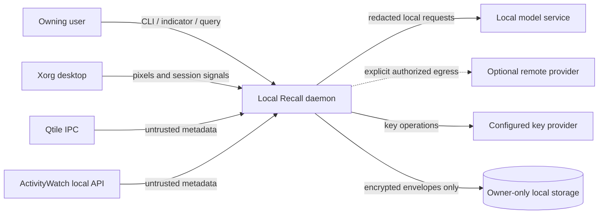
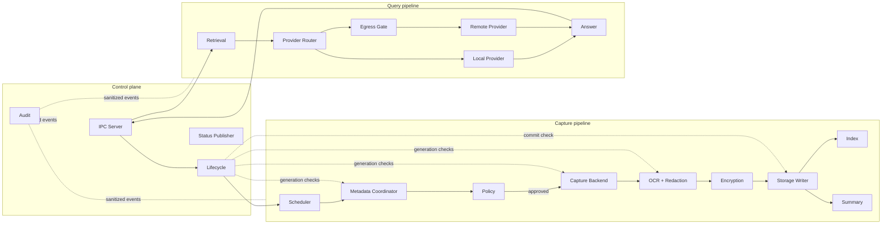
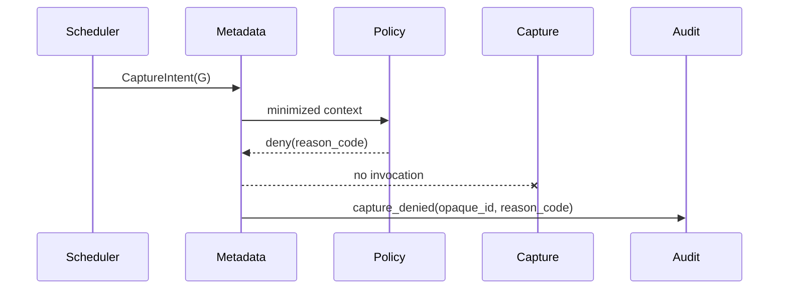

# Local Recall Architecture

**Status:** Draft for v0.1 implementation  
**Authority:** This document defines the v0.1 component boundaries and data flow. Implementation may strengthen isolation, validation, or privacy, but may not introduce an alternate path around the lifecycle gate, redaction boundary, encryption boundary, or provider-routing policy.  
**Tracking issue:** #3  
**Requirements:** [`requirements.md`](requirements.md)  
**Threat model:** [`threat-model.md`](threat-model.md)

## 1. Architectural goals

Local Recall is a single-user, local-first daemon that observes an explicitly enabled desktop session, converts approved observations into encrypted records, and later answers explicit questions over those records.

The architecture must make the following properties structural rather than conventional:

1. One component owns capture state and generation changes.
2. Work produced by an invalid generation cannot reach persistence.
3. Raw pixels, OCR, and metadata remain memory-only.
4. Storage accepts encrypted envelopes only.
5. Remote providers accept only explicitly authorized, redacted egress payloads.
6. Every long-running component has bounded work, cancellation, and supervision.
7. Query work cannot reactivate capture.
8. Xorg and future Wayland capture implement the same narrow port.
9. Failure of a critical privacy dependency stops or faults capture.
10. Tests can replace clocks, adapters, providers, storage, and operating-system signals deterministically.

## 2. Non-goals

The v0.1 architecture does not provide:

- distributed services;
- a broker such as RabbitMQ or Kafka;
- multi-user tenancy;
- arbitrary dynamically imported plugins;
- an extension API that can bypass typed stage boundaries;
- plaintext full-text or vector indexes;
- automatic remote fallback;
- daemon restart that resumes recording automatically;
- strong isolation from root, the kernel, or malicious same-UID processes;
- Wayland implementation, though its future backend is accounted for.

## 3. Decision summary

| Area | v0.1 decision | ADR |
|---|---|---|
| Runtime | Python 3.13+, typed async daemon, `uv` project workflow | [ADR-0001](adr/0001-python-runtime.md) |
| Concurrency | Supervised actor-style components over bounded AnyIO memory streams | [ADR-0002](adr/0002-supervised-actors.md) |
| Storage | Minimal SQLite catalog plus opaque authenticated-encrypted blob files | [ADR-0003](adr/0003-encrypted-storage.md) |
| Encryption | Per-record envelope encryption using XChaCha20-Poly1305 and pluggable key providers | [ADR-0004](adr/0004-envelope-encryption.md) |
| Extensions | Static built-in strategy registry; capability-limited adapters; no arbitrary imports | [ADR-0005](adr/0005-extension-boundaries.md) |

## 4. System context



The daemon is the only Local Recall process that coordinates lifecycle, policy, capture, storage, retrieval, and provider routing. Local model servers and metadata services are external and untrusted adapters even when they listen only on localhost.

## 5. Process topology

### 5.1 Single daemon

v0.1 runs one daemon process per owning user. This avoids persistent inter-service queues and limits the number of locations where raw capture data can exist.

The daemon contains supervised logical actors. Actors communicate through bounded in-memory mailboxes using immutable typed messages. Actor isolation is logical rather than a claim of memory isolation from another actor in the same Python process.

A daemon crash is fail-closed:

- in-memory raw data disappears with the process as far as the runtime and OS permit;
- partially written files contain encrypted bytes only;
- restart reconstructs a safe `off` state;
- no capture resumes without a new explicit start command.

### 5.2 External processes

External processes are reached only through adapters:

- Xorg server;
- Qtile IPC;
- ActivityWatch local HTTP API;
- Ollama or another configured local model service;
- a configured key service or GPG executable;
- an explicitly enabled remote provider.

External responses are untrusted, schema-validated, size-limited, timed out, and never granted direct access to storage or lifecycle state.

## 6. Supervision tree

```mermaid
flowchart TD
    Root[RootSupervisor]
    Root --> Life[LifecycleActor]
    Root --> IPC[IPCServerActor]
    Root --> Status[StatusPublisherActor]
    Root --> Audit[AuditActor]
    Root --> CaptureSup[CaptureSupervisor]
    Root --> QuerySup[QuerySupervisor]
    Root --> MaintSup[MaintenanceSupervisor]

    CaptureSup --> Session[SessionResolverActor]
    CaptureSup --> Scheduler[CaptureSchedulerActor]
    CaptureSup --> Metadata[MetadataCoordinatorActor]
    CaptureSup --> Policy[PolicyActor]
    CaptureSup --> Capture[CaptureActor]
    CaptureSup --> Redact[OCRRedactionActor]
    CaptureSup --> Encrypt[EncryptionActor]
    CaptureSup --> Store[StorageWriterActor]
    CaptureSup --> Index[IndexActor]
    CaptureSup --> Summary[SummaryActor]

    QuerySup --> Retrieve[RetrievalActor]
    QuerySup --> Router[ProviderRouterActor]
    QuerySup --> Answer[AnswerActor]

    MaintSup --> Retention[RetentionActor]
    MaintSup --> Backup[BackupRestoreActor]
    MaintSup --> Health[HealthActor]
```



### 6.1 Supervision rules

- `RootSupervisor` starts components in dependency order and shuts them down in reverse order.
- `LifecycleActor` is started before any capture actor and is the sole authority for public capture state and generation.
- A critical capture actor failure sends a fault request to `LifecycleActor`; it does not restart into recording automatically.
- Optional actor failures, such as an unavailable summary model, degrade capability without weakening privacy.
- Restart budgets are bounded. Exhaustion produces a sanitized fault state.
- Actor crashes never cause mailbox messages to be reported as successfully processed.

## 7. Authoritative lifecycle model

`LifecycleActor` owns:

- current public state;
- current capture generation;
- privacy mode;
- lock and idle-derived state;
- critical dependency health;
- transition serialization;
- cancellation scopes for capture generations.

No other actor may mutate lifecycle state directly.

### 7.1 Generation token

Every capture-triggered message carries a `CaptureGeneration` value issued by `LifecycleActor`.

A generation is invalidated on:

- stop;
- pause;
- privacy mode activation;
- lock;
- critical fault;
- daemon shutdown;
- daemon restart.

The generation is checked:

1. before metadata collection;
2. before screenshot capture;
3. immediately after screenshot capture;
4. before and after OCR/redaction;
5. before encryption;
6. immediately before the storage transaction commits.

`StorageWriterActor` must query or compare against the current lifecycle generation at commit time. A stale envelope is rejected even if upstream cancellation arrived late.

### 7.2 State storage

The daemon does not persist a state that can cause automatic recording. On startup, the public state is `off`. A minimal crash marker may exist for diagnostics, but it cannot authorize capture.

## 8. Type-state data pipeline

The pipeline uses distinct, non-interchangeable domain types:

```text
CaptureIntent
  -> ApprovedCaptureIntent
  -> RawFrame
  -> AnalyzedFrame
  -> RedactedRecord
  -> EncryptedEnvelope
  -> StoredRecordRef
```

Additional provider-specific safe types are:

```text
RedactedQueryContext -> LocalProviderRequest
RedactedQueryContext -> AuthorizedEgressPayload -> RemoteProviderRequest
```

### 8.1 Type rules

- `RawFrame` contains pixels and minimum metadata. It is non-serializable by application codecs and has no logging representation containing data.
- `AnalyzedFrame` contains raw OCR findings and remains memory-only.
- `RedactedRecord` contains only policy-approved redacted pixels, text, metadata, and provenance.
- `EncryptedEnvelope` contains authenticated ciphertext and non-sensitive envelope metadata.
- `StorageBackend.put()` accepts only `EncryptedEnvelope`.
- `RemoteProvider.generate()` accepts only `RemoteProviderRequest` created by `EgressGate`.
- No generic `dict[str, Any]` crosses a security boundary.
- Debug helpers cannot convert a raw type to JSON, repr its content, or write it to a file.

Python type checking is not a complete security boundary, so each external boundary also performs runtime validation.

## 9. Component boundaries

### 9.1 RootSupervisor

**Responsibility:** Start, supervise, and stop the daemon component tree.

**Inputs:** Process signals and top-level actor exits.  
**Outputs:** Sanitized fault events and orderly shutdown.  
**Must not:** Interpret captured content or restart capture automatically.

### 9.2 LifecycleActor

**Responsibility:** Serialize lifecycle commands and own capture generation.

**Inputs:** `StartCapture`, `PauseCapture`, `ResumeCapture`, `StopCapture`, `EnterPrivacy`, `ExitPrivacy`, `SessionLocked`, `SessionUnlocked`, `CriticalFault`.  
**Outputs:** `LifecycleSnapshot`, `GenerationInvalidated`, `CaptureEnabled`, `CaptureDisabled`.  
**Must not:** Capture pixels, call providers, or persist captured content.

### 9.3 SessionResolverActor

**Responsibility:** Detect Xorg/Wayland, desktop lock, idle state, and available metadata/capture capabilities.

**Ports:** `SessionProbe`, `LockMonitor`, `IdleMonitor`.  
**Failure:** Unsupported or uncertain session reports a critical dependency failure and remains non-recording.

### 9.4 CaptureSchedulerActor

**Responsibility:** Produce bounded capture intents from intervals and meaningful context changes.

**Inputs:** Lifecycle-enabled events, timer ticks, metadata change hints.  
**Outputs:** `CaptureIntent`.  
**Backpressure:** Coalesce pending triggers; never queue an unbounded historical backlog.

### 9.5 MetadataCoordinatorActor

**Responsibility:** Query and combine configured metadata strategies.

**Strategies:** Generic Xorg, Qtile, ActivityWatch.  
**Outputs:** `NormalizedMetadata` with field-level provenance and confidence.  
**Controls:** Fixed calls, schema validation, size limits, timeouts, field minimization.

### 9.6 PolicyActor

**Responsibility:** Resolve policy before capture and before later processing/egress stages.

**Inputs:** Lifecycle snapshot, normalized metadata, requested operation, active profile.  
**Outputs:** `PolicyDecision` with allow/deny, allowed fields, stage permissions, and sanitized reason codes.  
**Failure:** Parse, evaluation, timeout, or ambiguity returns deny.

### 9.7 CaptureActor

**Responsibility:** Invoke the selected capture backend and return pixels directly in memory.

**Port:**

```python
class CaptureBackend(Protocol):
    async def capture(self, request: ApprovedCaptureIntent) -> RawFrame: ...
```

The Xorg implementation is v0.1. A future Wayland implementation must satisfy the same contract and cannot change downstream stages.

### 9.8 OCRRedactionActor

**Responsibility:** Run local OCR, deterministic detectors, pixel masking, text redaction, and metadata redaction.

**Ports:** `OCRProvider`, `SecretDetector`, `ImageRedactor`, `TextRedactor`.  
**Output:** `RedactedRecord`.  
**Failure:** Any incomplete, uncertain, cancelled, oversized, or stale result rejects the entire item.

A model may add findings but cannot remove deterministic findings or become the sole detector.

### 9.9 EncryptionActor

**Responsibility:** Convert a `RedactedRecord` into an authenticated `EncryptedEnvelope`.

**Ports:** `EncryptionProvider`, `KeyProvider`.  
**Failure:** Missing/locked key, nonce failure, unsupported envelope version, or encryption error faults capture before persistence.

### 9.10 StorageWriterActor

**Responsibility:** Commit encrypted envelopes and minimal catalog metadata atomically.

**Port:**

```python
class StorageBackend(Protocol):
    async def put(self, envelope: EncryptedEnvelope) -> StoredRecordRef: ...
    async def delete(self, request: DeleteRequest) -> DeleteResult: ...
```

The storage port has no method accepting `bytes`, `RawFrame`, `AnalyzedFrame`, `RedactedRecord`, raw text, or arbitrary dictionaries.

### 9.11 IndexActor

**Responsibility:** Build encrypted time-partitioned semantic/index shards from approved redacted content.

**Failure:** Indexing failure does not rewrite or expose the source record. The encrypted source remains canonical and indexes remain rebuildable.

### 9.12 SummaryActor

**Responsibility:** Incrementally cluster records and generate local summaries.

**Input:** Redacted/decrypted minimum working data under an explicit internal job.  
**Output:** Encrypted summary artifacts with exact source membership and model provenance.  
**Failure:** Capture may continue without summaries when policy allows.

### 9.13 RetrievalActor

**Responsibility:** Resolve time ranges and filters, select coarse encrypted shards, decrypt the minimum candidate set, rank records, and discard working data after the query.

It cannot send network requests. Provider selection belongs to `ProviderRouterActor`.

### 9.14 ProviderRouterActor and EgressGate

**Responsibility:** Select a provider under the configured routing policy.

Provider choice is a policy result, not an exception fallback.

- `privacy-strict`: local provider only; deny remote.
- `local-only`: local provider only; explicit error if unavailable.
- `local-first`: local provider preferred; remote still requires an explicit request/authorization event for the current query and data class.
- `remote-explicit`: remote provider may be selected only after egress authorization.

`EgressGate` re-scans payloads, enforces allowed data classes and size, creates `AuthorizedEgressPayload`, and emits a sanitized audit event. Remote adapters never receive storage, key, raw-frame, or policy capabilities.

### 9.15 AnswerActor

**Responsibility:** Produce cited answers from retrieved evidence and provider output.

It distinguishes observations, inference, and insufficient evidence. Every factual statement must map to source record or cluster IDs and timestamps.

### 9.16 IPCServerActor

**Responsibility:** Serve authenticated owner-only control and query operations over a Unix-domain socket.

It performs request validation, peer checks where supported, capability authorization, size limits, deadlines, and priority dispatch. It binds no TCP listener by default.

### 9.17 StatusPublisherActor

**Responsibility:** Publish daemon-confirmed state to CLI and desktop indicator clients.

Status payloads contain no captured content. UI clients may request stop/privacy commands but may not optimistically claim recording state.

### 9.18 AuditActor

**Responsibility:** Write sanitized structured operational events.

The audit actor accepts only explicit event schemas containing opaque IDs, enum reason codes, component names, durations, and coarse operational counts. It rejects arbitrary exception dictionaries and provider payloads.

### 9.19 Maintenance actors

- `RetentionActor`: expiry, quota enforcement, and garbage collection.
- `BackupRestoreActor`: encrypted exports and validated restores.
- `HealthActor`: dependency probes and sanitized diagnostics.

Maintenance operations use the same storage, encryption, lifecycle, path-safety, and audit ports as normal work. No maintenance mode bypass exists.

## 10. Component diagram



## 11. Capture sequence

```mermaid
sequenceDiagram
    actor User
    participant IPC
    participant Life as Lifecycle
    participant Sched as Scheduler
    participant Meta as Metadata
    participant Policy
    participant Cap as Capture
    participant Redact as OCR/Redaction
    participant Enc as Encryption
    participant Store as Storage

    User->>IPC: start
    IPC->>Life: StartCapture
    Life->>Life: validate dependencies; create generation G
    Life-->>IPC: recording(G)
    Sched->>Life: request current snapshot
    Life-->>Sched: recording(G)
    Sched->>Meta: CaptureIntent(G)
    Meta->>Life: validate G
    Meta->>Policy: normalized minimum metadata
    Policy-->>Meta: approved stage permissions
    Meta->>Cap: ApprovedCaptureIntent(G)
    Cap->>Life: validate G immediately before capture
    Cap->>Cap: capture pixels in memory
    Cap->>Life: validate G after capture
    Cap->>Redact: RawFrame(G)
    Redact->>Redact: local OCR + deterministic detection + masking
    Redact->>Life: validate G
    Redact->>Enc: RedactedRecord(G)
    Enc->>Enc: authenticated envelope encryption
    Enc->>Store: EncryptedEnvelope(G)
    Store->>Life: final commit validation for G
    Life-->>Store: current
    Store->>Store: encrypted file + catalog transaction
    Store-->>Sched: StoredRecordRef
```

## 12. Stop and stale-work sequence

```mermaid
sequenceDiagram
    actor User
    participant IPC
    participant Life as Lifecycle
    participant Actors as Capture actors
    participant Store as Storage

    User->>IPC: stop
    IPC->>Life: StopCapture
    Life->>Life: invalidate generation G; state=stopping
    Life--xActors: cancel generation G
    Actors-->>Actors: destroy/drop queued raw work
    Actors->>Store: late EncryptedEnvelope(G)
    Store->>Life: final commit validation G
    Life-->>Store: stale
    Store--xStore: reject; no catalog commit
    Life->>Life: state=off
    Life-->>IPC: off; no pending persistence
```

Cancellation is necessary but not sufficient. The commit-time generation check is the final stale-work barrier.

## 13. Denied-context sequence



When sufficient pre-capture metadata exists, a denied context produces no screenshot.

## 14. Explicit query sequence

```mermaid
sequenceDiagram
    actor User
    participant IPC
    participant Ret as Retrieval
    participant Store
    participant Router
    participant Provider
    participant Answer

    User->>IPC: ask(time range, question)
    IPC->>Ret: AuthorizedQuery
    Ret->>Store: select coarse candidate shards
    Store-->>Ret: encrypted envelopes
    Ret->>Ret: decrypt minimum set; exact filter/rank
    Ret->>Router: RedactedQueryContext + routing policy
    Router->>Provider: typed local or authorized remote request
    Provider-->>Router: untrusted structured response
    Router->>Answer: validated response + evidence
    Answer-->>IPC: cited answer
    IPC-->>User: answer
    Ret->>Ret: discard decrypted working set
```

This path may execute while capture is `off`. It cannot issue capture intents or change lifecycle state.

## 15. Mailboxes and backpressure

Every actor mailbox is bounded and has an explicit overload policy.

| Work class | Default overload policy |
|---|---|
| Lifecycle/control | Reserved capacity; stop/privacy commands have highest priority; never silently dropped. |
| Capture triggers | Coalesce to the newest relevant trigger. |
| Metadata change hints | Debounce and coalesce. |
| Raw frames | Capacity kept very small; drop newest or pause according to policy before memory becomes unbounded. |
| OCR/redaction jobs | Bounded concurrency; timeout rejects record. |
| Storage writes | Small bounded queue; overload pauses or faults capture rather than accumulating plaintext work. |
| Summaries/index rebuild | Low priority; restartable checkpoints; capture may continue if source storage is healthy. |
| Queries | Per-client and global concurrency limits; explicit cancellation/deadline. |
| Audit events | Reserved sanitized queue; critical state events cannot be replaced by content-rich fallback logs. |

Queue metrics expose counts only, never content.

## 16. Failure classification

### 16.1 Critical privacy failures

These force a non-recording `faulted` or `off` state:

- lifecycle state cannot be read consistently;
- unsupported or uncertain capture session;
- policy cannot be validated/evaluated;
- pre-capture lock state is uncertain where lock detection is required;
- redaction fails or is incomplete;
- encryption/key provider is unavailable, locked, invalid, or misconfigured;
- storage permissions are insecure;
- storage receives an invalid envelope;
- final generation validation cannot be performed;
- status indicator cannot satisfy the visible-recording invariant once that feature is enabled.

### 16.2 Degraded optional failures

These may preserve capture if policy explicitly permits:

- ActivityWatch unavailable while another metadata strategy remains valid;
- local summary model unavailable;
- semantic index rebuild delayed;
- remote provider unavailable;
- backup destination unavailable;
- non-critical diagnostics failure.

A degraded state cannot widen capture or egress permissions.

## 17. Storage architecture

### 17.1 Directory layout

```text
$XDG_STATE_HOME/local-recall/
  catalog.sqlite3
  blobs/
    <opaque-shard>/<opaque-record-id>.lre
  indexes/
    <opaque-index-id>.lri
  audit/
    audit-YYYYMM.jsonl
  migrations/
    journal.sqlite3
  run/
    daemon.sock
```

Runtime socket placement may use `$XDG_RUNTIME_DIR/local-recall/` when available. Every directory and file is owner-only. Filenames contain no titles, application names, exact timestamps, query text, or user-derived labels.

### 17.2 SQLite catalog

The catalog contains only routing and transaction metadata approved by the threat model:

- random opaque record ID;
- artifact kind enum;
- envelope/schema version;
- key identifier with no key material;
- ciphertext length;
- coarse UTC day bucket;
- opaque blob path token;
- transaction/deletion state;
- integrity/version fields.

Exact timestamps, applications, workspaces, titles, OCR, summaries, prompts, embeddings, and citations remain inside encrypted envelopes.

A coarse day bucket leaks which days contain records and approximate volume. This is an accepted v0.1 tradeoff to bound query decryption. The exact leakage is documented in ADR-0003 and may be removed by a future oblivious index design.

### 17.3 Blob commit

1. `EncryptionActor` produces the full envelope in memory.
2. `StorageWriterActor` creates an owner-only random temporary file in the target directory.
3. Only encrypted bytes are written.
4. The file is flushed and atomically renamed to an opaque final name.
5. A SQLite transaction records the catalog entry after final generation validation.
6. Crash recovery removes encrypted orphan files or resumes catalog reconciliation.

No plaintext temporary file exists.

### 17.4 Semantic index

v0.1 stores embedding vectors in encrypted, coarse-time-partitioned shards. Query execution:

1. selects relevant shard IDs from coarse buckets;
2. decrypts candidate vectors in memory;
3. performs exact or bounded approximate ranking in memory;
4. decrypts only the selected source records;
5. discards vectors and records after completion.

This favors confidentiality over global low-latency ANN search. The encrypted source remains canonical and every index is rebuildable.

## 18. Encryption architecture

Each content-bearing artifact uses envelope encryption:

- a random per-artifact data-encryption key (DEK);
- XChaCha20-Poly1305 authenticated encryption for content;
- a configured `KeyProvider` supplies or unwraps the key-encryption key (KEK);
- the DEK is wrapped and stored in the envelope;
- associated data binds version, opaque record ID, artifact kind, key ID, and approved catalog fields;
- key and algorithm identifiers are versioned;
- GPG is an explicitly selected key-provider strategy, never an automatic fallback.

Key-provider failure prevents persistence. Python cannot guarantee complete secret zeroization, so decrypted key and content lifetimes are minimized and never cached beyond bounded operations.

## 19. Provider architecture

### 19.1 Provider ports

```python
class GenerationProvider(Protocol):
    async def capabilities(self) -> GenerationCapabilities: ...
    async def generate(self, request: ProviderRequest) -> ProviderResponse: ...

class EmbeddingProvider(Protocol):
    async def capabilities(self) -> EmbeddingCapabilities: ...
    async def embed(self, request: EmbeddingRequest) -> EmbeddingResponse: ...
```

Provider requests are immutable typed objects created by the router. Provider outputs are untrusted and schema-validated.

### 19.2 Strategy and policy separation

- **Strategy:** how to invoke Ollama, OpenAI-compatible APIs, OpenRouter, Anthropic, or Google.
- **Routing policy:** whether a provider is eligible for a given operation and data class.

Strategies do not decide privacy. Policies do not perform network calls.

### 19.3 Network capability

Remote provider adapters receive a narrow network client from `EgressGate`; they do not construct arbitrary network clients. Local-only and privacy-strict profiles provide no remote network capability at all.

## 20. Extension boundaries

v0.1 extensions are built-in adapters registered by stable string identifiers. Configuration may select a registered adapter but may not import an arbitrary module or execute a command.

Each adapter receives only the capability it requires:

| Adapter type | Granted capability | Explicitly denied |
|---|---|---|
| Capture backend | Approved capture intent and desktop capture API | Storage, keys, providers, policy mutation |
| Metadata source | Fixed local metadata client and limits | Raw storage, network egress, shell interpolation |
| OCR provider | In-memory image view | Filesystem output, provider routing, storage |
| Key provider | Key reference and minimal key operation | Captured content, query text, logs |
| Storage backend | Encrypted envelope and catalog transaction | Raw/redacted plaintext types, provider access |
| Model provider | Typed approved request | Lifecycle mutation, keys, direct storage access |

General script adapters and third-party plugin loading are deferred. Their future implementation requires updated threat analysis and must not alter these capability boundaries.

## 21. Xorg now, Wayland later

`CaptureBackend`, `SessionProbe`, `LockMonitor`, and metadata ports contain no Xorg-specific types. Xorg identifiers are normalized inside the Xorg adapter.

A Wayland backend may later implement the same ports through desktop portals and PipeWire. Portal authorization or revocation maps to lifecycle dependency health. Downstream OCR, redaction, encryption, storage, and query components remain unchanged.

## 22. Configuration architecture

Configuration is versioned and loaded into immutable snapshots.

- Pydantic validates external configuration.
- Secrets are key references, not values.
- Reload builds and validates a complete candidate snapshot before an atomic swap.
- A failed reload leaves the last valid configuration active, except a discovered critical insecurity faults capture.
- Every actor receives the same configuration revision ID with work messages.
- A record produced under an old revision cannot be persisted if a policy change invalidates its generation.

Default first-run configuration records nothing until explicitly enabled.

## 23. Observability

Observability is event-schema first, not exception-dump first.

Allowed fields include:

- event type;
- actor/component identifier;
- opaque record/job ID;
- lifecycle state and generation hash/token surrogate;
- sanitized reason code;
- duration and bounded count;
- provider/backend identifier;
- schema/config revision;
- error class from an allowlist.

Forbidden fields include captured values, screenshots, OCR, titles, URLs, query text, prompts, provider payloads, usernames, absolute personal paths, tokens, and key material.

Uncaught exceptions are converted to sanitized fault events. Debug mode cannot weaken sanitization.

## 24. Test architecture

Issue #4 establishes the executable harness. This architecture requires these test seams:

- injectable monotonic and wall clocks;
- fake lifecycle state and deterministic generation source;
- contract test suites for every strategy port;
- synthetic capture backends and metadata adapters;
- in-memory or temporary encrypted storage fixtures;
- deterministic key providers using synthetic keys;
- mock local and remote provider servers;
- mailbox capacity and scheduling controls;
- fault injection at every stage transition;
- process restart and crash-recovery fixtures;
- filesystem scanners for seeded plaintext;
- network denial fixtures for local-only tests;
- meta-tests proving failures propagate non-zero.

Security-critical type boundaries require both static checks and runtime negative tests. Tests must prove that raw types cannot be passed to storage or remote-provider APIs.

## 25. Proposed source layout

```text
src/local_recall/
  domain/
    lifecycle.py
    records.py
    messages.py
    policy.py
    errors.py
  actors/
    supervisor.py
    lifecycle.py
    capture.py
    metadata.py
    redaction.py
    encryption.py
    storage.py
    retrieval.py
    providers.py
    maintenance.py
  ports/
    capture.py
    metadata.py
    ocr.py
    encryption.py
    keys.py
    storage.py
    providers.py
    clock.py
  adapters/
    xorg/
    qtile/
    activitywatch/
    ollama/
    remote/
    sqlite_blob/
    keys/
  services/
    policy.py
    egress.py
    clustering.py
    answering.py
  ipc/
    server.py
    protocol.py
  cli/
    main.py
  config/
    schema.py
    loader.py
  observability/
    audit.py
    sanitize.py
  app.py

tests/
  unit/
  contract/
  integration/
  security/
  e2e/
  failure_injection/
```

Dependencies point inward: adapters depend on ports and domain types; domain code does not depend on adapters.

## 26. Requirement and threat-boundary traceability

| Architecture mechanism | Requirements/invariants | Threat boundaries |
|---|---|---|
| Lifecycle actor + generation commit check | `STATE-001`, `FR-CAP-004`, `INV-001`, `INV-005` | `TB-01`, `TB-03` |
| Stage-specific raw/redacted/encrypted types | `FR-RED-010`, `FR-STO-003`, `INV-002`, `INV-003` | `TB-03`, `TB-04`, `TB-05` |
| Policy actor fail-deny | `FR-POL-001`–`008`, `INV-004` | `TB-02`, `TB-03` |
| Per-record envelope encryption | `FR-STO-001`–`012`, `INV-002` | `TB-04`, `TB-05`, `TB-09` |
| Minimal catalog + encrypted shards | `FR-STO-010`, `FR-RET-003`, `INV-002` | `TB-05` |
| Provider router + egress gate | `FR-AI-005`–`013`, `INV-006`, `INV-007`, `INV-014` | `TB-07`, `TB-08` |
| Owner-only IPC | `FR-CTL-002`–`004`, `INV-010` | `TB-06` |
| Bounded actors/mailboxes | `FR-CAP-008`, `NFR-003`, `INV-011` | `TB-03`, `TB-07`, `TB-08` |
| Sanitized audit schema | `FR-POL-007`, `FR-CTL-008`, `INV-008` | `TB-11` |
| Source membership and answer actor | `FR-RET-006`–`009`, `INV-012` | `TB-05`, `TB-07`, `TB-08` |
| Transactional deletion/maintenance | `FR-CTL-010`–`011`, `FR-LIFE-001`–`008`, `INV-013` | `TB-05`, `TB-10` |

## 27. Implementation order constraints

The issue order is also an architectural dependency order:

1. Establish test harness and CI integrity (#4).
2. Define typed domain models and ports (#5).
3. Implement validated configuration (#6).
4. Implement lifecycle authority and generation cancellation (#7).
5. Implement bounded actor pipeline (#8).
6. Implement OCR/redaction before encryption/storage (#9–#12).
7. Add metadata, policy, and Xorg capture (#13–#20).
8. Add providers, retrieval, answering, controls, and lifecycle management (#21–#32).
9. Add deferred adapters and release hardening (#33–#41).

No issue may introduce production capture before the test harness, lifecycle gate, redaction boundary, encryption boundary, and encrypted-only storage port exist in the required order.

## 28. Change control

An architecture change requires a new or updated ADR when it changes:

- runtime or concurrency model;
- process boundaries;
- lifecycle authority;
- stage-specific data types;
- storage metadata leakage;
- encryption algorithm or key hierarchy;
- plugin loading or capabilities;
- remote egress path;
- persistent artifact set;
- capture backend contract;
- failure classification.

Changes that weaken an invariant also require requirements and threat-model updates plus a failing security test before implementation.