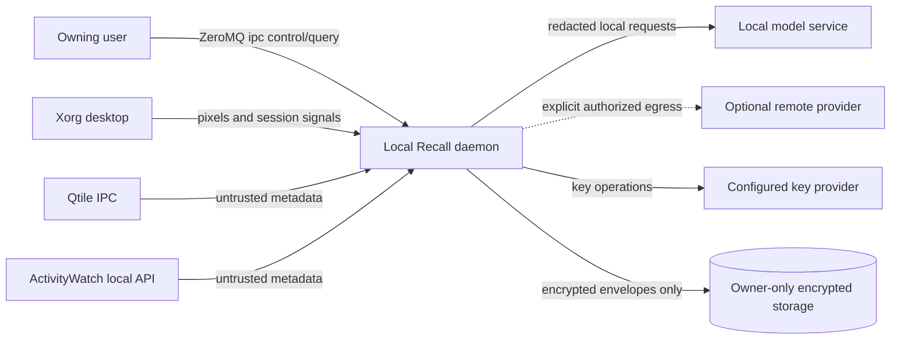
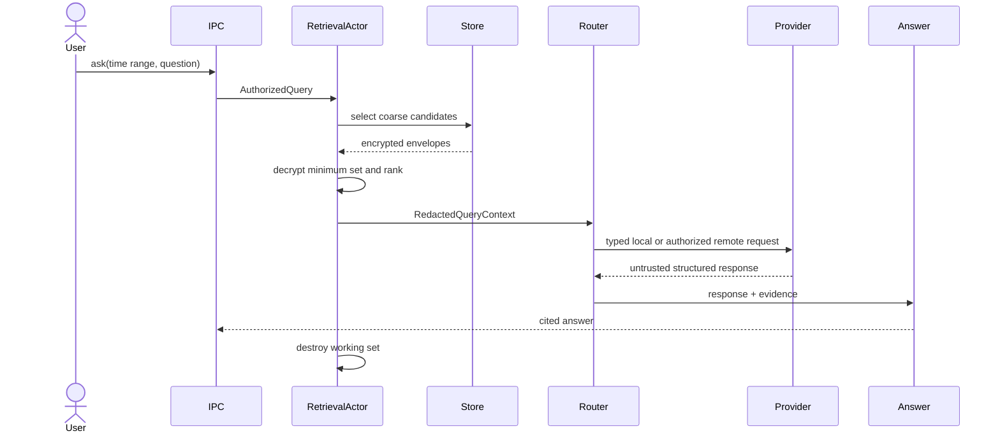

# Local Recall Architecture

**Status:** Draft for v0.1 implementation  
**Authority:** This document defines the v0.1 component boundaries and data flow. Implementation may strengthen isolation, validation, or privacy, but may not introduce an alternate path around the lifecycle gate, redaction boundary, encryption boundary, storage boundary, or provider-routing policy.  
**Tracking issue:** #3  
**Requirements:** [`requirements.md`](requirements.md)  
**Threat model:** [`threat-model.md`](threat-model.md)

Session lock and idle safety is an orthogonal authority over the lifecycle/policy gates; see [session-safety.md](session-safety.md). It reuses capture-generation invalidation rather than creating a competing lifecycle.

## 1. Architectural goals

Local Recall is a single-user, local-first daemon that observes an explicitly enabled desktop session, converts approved observations into encrypted records, and later answers explicit questions over those records.

The architecture makes these properties structural:

1. One actor owns capture state and generation changes.
2. Work produced by an invalid generation cannot reach persistence.
3. Raw pixels, OCR, and metadata remain memory-only.
4. Storage accepts encrypted envelopes only.
5. Remote providers accept only explicitly authorized, redacted egress payloads.
6. Every actor and transport edge has bounded work, timeout, cancellation, and supervision rules.
7. Query work cannot reactivate capture.
8. Xorg and future Wayland capture implement the same narrow port.
9. Failure of a critical privacy dependency stops or faults capture.
10. Tests can replace clocks, adapters, providers, transport, storage, and operating-system signals deterministically.

## 2. Non-goals

The v0.1 architecture does not provide:

- distributed services;
- RabbitMQ, Kafka, or another external broker;
- persistent actor queues;
- multi-user tenancy;
- arbitrary dynamically imported plugins;
- an extension API that can bypass typed stage boundaries;
- plaintext full-text or vector indexes;
- automatic remote fallback;
- daemon restart that resumes recording automatically;
- strong isolation from root, the kernel, or malicious same-UID processes;
- Wayland implementation, though its future backend is accounted for.

ZeroMQ is a transport library, not a durable broker. No ZeroMQ message may be spooled to disk by Local Recall.

## 3. Decision summary

| Area | v0.1 decision | ADR |
|---|---|---|
| Runtime | Python 3.13+, typed daemon, `uv` project workflow | [ADR-0001](adr/0001-python-runtime.md) |
| Actors and transport | Pykka `ThreadingActor` components with ZeroMQ data-plane transport | [ADR-0006](adr/0006-pykka-zmq-actors.md) |
| Storage | Minimal SQLite catalog plus opaque authenticated-encrypted blob files | [ADR-0003](adr/0003-encrypted-storage.md) |
| Encryption | Per-record envelope encryption using XChaCha20-Poly1305 and pluggable key providers | [ADR-0004](adr/0004-envelope-encryption.md) |
| Extensions | Static built-in strategy registry; capability-limited adapters; no arbitrary imports | [ADR-0005](adr/0005-extension-boundaries.md) |

ADR-0006 supersedes ADR-0002. AnyIO memory streams are not the actor message bus.

## 4. System context



The daemon is the only Local Recall process coordinating lifecycle, policy, capture, storage, retrieval, and provider routing. Local model servers and metadata services are external and untrusted even when reached over localhost.

## 5. Process and actor topology

### 5.1 One daemon process

v0.1 runs one daemon process per owning user. The daemon contains a fixed, bounded set of Pykka `ThreadingActor` instances.

Pykka provides:

- actor lifecycle hooks;
- actor references;
- actor-owned mutable state;
- actor registry support;
- request/reply futures;
- one execution thread per actor.

The project provides its own supervision policy. Pykka actor registration does not itself constitute an Akka-style supervisor tree.

A daemon crash is fail-closed:

- volatile raw data disappears with the process as far as Python and the OS permit;
- ZeroMQ sockets use zero linger and are closed during teardown;
- partially written files contain encrypted bytes only;
- restart reconstructs `off`;
- recording never resumes without a new explicit command.

### 5.2 Actor control plane

Pykka `ActorRef.ask()` and `tell()` are used only for low-volume control and supervision messages, including:

- lifecycle transitions;
- actor health;
- configuration revisions;
- startup and shutdown;
- typed fault notifications;
- bounded request/reply coordination.

Raw frames, OCR payloads, embeddings, and other bulk pipeline data must not accumulate in a Pykka actor inbox.

Control actors are deliberately narrow. `LifecycleActor`, for example, never receives frame data, model output, or arbitrary metadata.

### 5.3 ZeroMQ data plane

ZeroMQ carries typed pipeline messages between actor boundaries.

A single process-owned `zmq.Context` is created by `RootSupervisor` and terminated during shutdown. Every socket is owned and used by exactly one actor thread. ZeroMQ sockets are never shared concurrently across actor threads.

Transport scopes:

- `inproc://` is used for all raw and redacted capture pipeline edges inside the daemon;
- `ipc://` is used for owner-only CLI, status, and query clients on Linux;
- `tcp://` is disabled by default and is not part of v0.1 local IPC;
- raw pixels, raw OCR, and unredacted metadata must never cross an `ipc://` or `tcp://` endpoint.

### 5.4 Pykka/ZeroMQ integration pattern

Each pipeline edge is represented by a project-owned `ZmqPumpActor` or an equivalent stage-specific Pykka actor:

1. The actor owns its ZeroMQ receiving socket.
2. The socket is configured before bind/connect.
3. The actor polls or receives one bounded message with a deadline.
4. Multipart frames are size-checked before decoding.
5. The versioned header is runtime validated into a typed domain message.
6. The actor synchronously dispatches the work to the target Pykka actor with a deadline.
7. The pump does not receive the next message until the target returns success, rejection, cancellation, overload, or fault.
8. The result is acknowledged or rejected over the corresponding ZeroMQ edge.

This limits the number of payloads removed from ZeroMQ high-water-mark control but not yet processed by a target actor. Pipeline parallelism is created only by an explicit, bounded number of pump/worker actors.

No generic bridge may deserialize arbitrary Python objects. Pickle is prohibited.

## 6. ZeroMQ transport contract

### 6.1 Socket patterns

| Use | Pattern | Transport | Notes |
|---|---|---|---|
| Ordered capture stages | `PUSH/PULL` | `inproc://` | One-way typed work with explicit result/ack edge where required. |
| Addressed actor commands | `ROUTER/DEALER` | `inproc://` | Correlation ID, deadline, generation, and reply status required. |
| CLI and query API | `ROUTER/DEALER` | `ipc://` | Owner-only endpoint, authenticated session token, no TCP listener. |
| Sanitized status events | `PUB/SUB` | `inproc://` and selected `ipc://` | State only; subscribers must query authoritative status after reconnect. |
| Sanitized audit fanout | `PUB/SUB` or direct writer edge | `inproc://` | Content-bearing values prohibited. |

PUB/SUB is never used for authoritative lifecycle commands because subscribers may miss messages.

### 6.2 Message framing

Messages use ZeroMQ multipart frames:

1. versioned UTF-8 JSON header;
2. zero or more binary payload frames;
3. optional detached integrity or correlation fields when the protocol requires them.

The header contains only typed routing fields such as:

- protocol version;
- message type;
- opaque job ID;
- capture generation;
- configuration revision;
- monotonic deadline;
- payload frame count and declared sizes;
- sanitized reply status.

Raw content never appears in routing identities, endpoints, filenames, logs, or exception strings.

### 6.3 Required socket options

Every socket has explicit configuration and contract tests for:

- `SNDHWM` and `RCVHWM`;
- `SNDTIMEO` and `RCVTIMEO` or nonblocking send/receive with an application deadline;
- `LINGER=0` during fault and shutdown paths;
- `IMMEDIATE=1` where queued sends to unavailable peers would be unsafe;
- maximum accepted multipart frame count;
- maximum header and payload size;
- endpoint allowlist;
- restricted bind/connect role.

High-water marks are defense in depth, not the only bound. The application also uses explicit credits, bounded pump counts, and generation/deadline rejection.

### 6.4 Overload semantics

A failed or timed-out send returns a typed overload result. It must not:

- retry without a finite budget;
- create another queue;
- write a temporary file;
- fall back to RabbitMQ or another broker;
- silently drop a lifecycle command;
- return success.

Raw-frame edges default to capacity one or another very small tested bound. When saturated, capture is dropped, paused, coalesced, or faulted according to policy before plaintext work grows.

## 7. Supervision tree

```mermaid
flowchart TD
    Root[RootSupervisor - Pykka]
    Root --> Life[LifecycleActor]
    Root --> Transport[TransportSupervisor]
    Root --> IPC[IPCServerActor]
    Root --> Status[StatusPublisherActor]
    Root --> Audit[AuditActor]
    Root --> CaptureSup[CaptureSupervisor]
    Root --> QuerySup[QuerySupervisor]
    Root --> MaintSup[MaintenanceSupervisor]

    Transport --> Ctx[ZeroMQ Context]
    Transport --> Pumps[Bounded ZmqPumpActors]

    CaptureSup --> Session[SessionResolverActor]
    CaptureSup --> Scheduler[CaptureSchedulerActor]
    CaptureSup --> Metadata[MetadataCoordinatorActor]
    CaptureSup --> Policy[PolicyActor]
    CaptureSup --> Capture[CaptureActor]
    CaptureSup --> Redact[OCRRedactionActor]
    CaptureSup --> Encrypt[EncryptionActor]
    CaptureSup --> Store[StorageWriterActor]
    CaptureSup --> Index[IndexActor]
    CaptureSup --> Summary[SummaryActor]

    QuerySup --> Retrieve[RetrievalActor]
    QuerySup --> Router[ProviderRouterActor]
    QuerySup --> Answer[AnswerActor]

    MaintSup --> Retention[RetentionActor]
    MaintSup --> Backup[BackupRestoreActor]
    MaintSup --> Health[HealthActor]
```



### 7.1 Supervision rules

- `RootSupervisor` starts actors and transport endpoints in dependency order and stops them in reverse order.
- `LifecycleActor` starts before any capture actor and solely owns public capture state and generation.
- `TransportSupervisor` owns the ZeroMQ context, endpoint registry, and socket configuration policy.
- A critical capture actor or transport failure requests a lifecycle fault before restart is considered.
- Critical actors never restart into recording.
- Optional actors may restart within a bounded budget.
- Restart exhaustion produces a sanitized fault.
- An actor crash or broken ZeroMQ edge never becomes a successful outcome.
- `ActorRegistry` is used for supervised discovery and teardown, not as an unrestricted global service locator.

## 8. Authoritative lifecycle model

`LifecycleActor` owns:

- current public state;
- current capture generation;
- privacy mode;
- lock and idle-derived state;
- critical dependency health;
- transition serialization;
- generation invalidation.

No other actor may mutate lifecycle state directly.

### 8.1 Generation token

Every capture-triggered message carries a `CaptureGeneration` issued by `LifecycleActor`.

A generation is invalidated on:

- stop;
- pause;
- privacy mode activation;
- lock;
- critical fault;
- daemon shutdown;
- daemon restart.

Generation is checked:

1. before metadata collection;
2. before screenshot capture;
3. immediately after screenshot capture;
4. before and after OCR/redaction;
5. before encryption;
6. immediately before storage commit.

ZeroMQ delivery, actor stop, socket closure, and cancellation are not trusted as the final stale-write barrier. `StorageWriterActor` must reject stale generations immediately before committing its catalog transaction.

### 8.2 State storage

The daemon never persists a state that authorizes automatic recording. Startup state is always `off`.

## 9. Type-state pipeline

```text
CaptureIntent
  -> ApprovedCaptureIntent
  -> RawFrame
  -> AnalyzedFrame
  -> RedactedRecord
  -> EncryptedEnvelope
  -> StoredRecordRef
```

Provider-safe types are:

```text
RedactedQueryContext -> LocalProviderRequest
RedactedQueryContext -> AuthorizedEgressPayload -> RemoteProviderRequest
```

Rules:

- `RawFrame` is memory-only and cannot be encoded by a general application serializer.
- `AnalyzedFrame` contains raw OCR findings and is memory-only.
- `RedactedRecord` contains policy-approved redacted content and provenance.
- `EncryptedEnvelope` contains authenticated ciphertext and approved non-sensitive metadata.
- storage accepts only `EncryptedEnvelope`;
- remote providers accept only `RemoteProviderRequest` created by `EgressGate`;
- no generic `dict[str, Any]` or pickled object crosses a security boundary;
- every ZeroMQ header is decoded into a concrete validated message type before dispatch;
- debug representations of raw types contain identifiers and sizes only.

Static typing is reinforced by runtime validation at every transport, provider, storage, and IPC boundary.

## 10. Component boundaries

### RootSupervisor

Starts, monitors, and stops Pykka actors and the ZeroMQ context. It never handles captured content.

### TransportSupervisor

Creates the one process-owned ZeroMQ context, assigns approved endpoints, enforces socket option policy, and tears down endpoints with zero linger. It cannot authorize capture or inspect payload content.

### LifecycleActor

Serializes lifecycle commands and owns generations. It never captures pixels, calls providers, or persists content.

### SessionResolverActor

Detects Xorg/Wayland, lock, idle, and available capabilities. Unsupported or uncertain sessions remain non-recording.

### CaptureSchedulerActor

Produces bounded `CaptureIntent` messages from intervals and meaningful context changes. Triggers are coalesced rather than accumulated.

### MetadataCoordinatorActor

Combines generic Xorg, Qtile, and ActivityWatch strategies into validated metadata with field-level provenance and confidence.

### PolicyActor

Evaluates pre-capture and later-stage policy. Parse, timeout, evaluation, or ambiguity returns deny.

### CaptureActor

Invokes the selected backend and returns pixels in memory. Xorg is v0.1; Wayland later implements the same port.

```python
class CaptureBackend(Protocol):
    def capture(self, request: ApprovedCaptureIntent) -> RawFrame: ...
```

### OCRRedactionActor

Runs local OCR, deterministic detectors, masking, text redaction, and metadata redaction. Any incomplete, uncertain, stale, cancelled, or oversized result rejects the record.

### EncryptionActor

Converts a `RedactedRecord` into an authenticated `EncryptedEnvelope`. Missing or invalid key material faults capture before persistence.

### StorageWriterActor

Commits encrypted envelopes and minimal catalog metadata atomically.

```python
class StorageBackend(Protocol):
    def put(self, envelope: EncryptedEnvelope) -> StoredRecordRef: ...
    def delete(self, request: DeleteRequest) -> DeleteResult: ...
```

The storage port accepts no raw bytes, raw frames, redacted plaintext objects, arbitrary dictionaries, or provider payloads.

### IndexActor

Builds encrypted coarse-time-partitioned index shards. Index failure does not expose or rewrite canonical encrypted records.

### SummaryActor

Clusters records and produces encrypted summaries with exact source membership and model provenance.

### RetrievalActor

Resolves time ranges, selects encrypted candidates, decrypts the minimum working set, ranks records, and destroys working data after completion or cancellation. It cannot select or call remote providers.

### ProviderRouterActor and EgressGate

Provider choice is a policy result, not an exception fallback.

- `privacy-strict`: local provider only;
- `local-only`: local provider only;
- `local-first`: local preferred, remote still needs explicit authorization for this query and data class;
- `remote-explicit`: remote requires an authorized egress payload.

`EgressGate` re-scans payloads, applies data-class and size limits, and creates `AuthorizedEgressPayload`.

### AnswerActor

Produces cited answers and distinguishes observation, inference, and insufficient evidence.

### IPCServerActor

Uses ZeroMQ `ipc://` ROUTER/DEALER for owner-only local control and query requests. It binds no TCP endpoint by default. Authentication and authorization remain required even on a local socket.

### StatusPublisherActor

Publishes sanitized daemon-confirmed state. PUB/SUB updates are advisory; clients query authoritative status after startup or reconnect.

### AuditActor

Writes sanitized structured events. It rejects arbitrary exception dictionaries and payload fields.

### Maintenance actors

Retention, backup/restore, and health operations use the same storage, encryption, path-safety, lifecycle, and audit boundaries. No maintenance bypass exists.

## 11. Capture sequence

```mermaid
sequenceDiagram
    actor User
    participant IPC
    participant Life as LifecycleActor
    participant Sched as SchedulerActor
    participant Meta as MetadataActor
    participant Policy
    participant Z1 as ZMQ inproc edge
    participant Cap as CaptureActor
    participant Redact as OCRRedactionActor
    participant Enc as EncryptionActor
    participant Store as StorageActor

    User->>IPC: start
    IPC->>Life: StartCapture
    Life->>Life: validate dependencies; issue G
    Life-->>IPC: recording(G)
    Sched->>Meta: CaptureIntent(G)
    Meta->>Life: validate G
    Meta->>Policy: minimized metadata
    Policy-->>Meta: approved permissions
    Meta->>Z1: ApprovedCaptureIntent(G)
    Z1->>Cap: validated typed request
    Cap->>Life: validate G
    Cap->>Cap: capture into memory
    Cap->>Life: validate G again
    Cap->>Redact: RawFrame(G) over inproc edge
    Redact->>Redact: OCR + deterministic detection + masking
    Redact->>Life: validate G
    Redact->>Enc: RedactedRecord(G)
    Enc->>Store: EncryptedEnvelope(G)
    Store->>Life: final commit validation G
    Life-->>Store: current
    Store->>Store: encrypted file + catalog transaction
```

## 12. Stop and stale-work sequence

```mermaid
sequenceDiagram
    actor User
    participant IPC
    participant Life as LifecycleActor
    participant Sup as Supervisors
    participant ZMQ as ZeroMQ edges
    participant Store

    User->>IPC: stop
    IPC->>Life: StopCapture
    Life->>Life: invalidate G; state=stopping
    Life-->>Sup: GenerationInvalidated(G)
    Sup-->>ZMQ: stop intake; drop stale queued messages
    ZMQ-->>ZMQ: close faulted endpoints with LINGER=0 when required
    Store->>Life: late commit validation G
    Life-->>Store: stale
    Store--xStore: reject; no commit
    Life->>Life: state=off
    Life-->>IPC: off
```

Pykka actor shutdown and ZeroMQ socket closure accelerate cancellation. Generation validation remains the authoritative stale-write barrier.

## 13. Explicit query sequence



This path can execute while capture is off and cannot issue capture intents.

## 14. Backpressure and priority

| Work class | Bound and overload behavior |
|---|---|
| Lifecycle/control | Dedicated Pykka actor; synchronous request deadlines; never silently dropped. |
| Capture triggers | Coalesce to newest relevant intent before ZeroMQ send. |
| Metadata hints | Debounce and coalesce. |
| Raw frames | `inproc://` only; HWM and application credit normally one; drop or pause before growth. |
| OCR/redaction | Fixed number of actors/pumps; timeout rejects record. |
| Storage writes | Small bounded edge; overload pauses or faults capture. |
| Summaries/index rebuild | Low priority, restartable, bounded. |
| Queries | Per-client and global concurrency limits. |
| Audit/status | Sanitized bounded channels; no content fallback logging. |

Stop and privacy operations do not compete with raw-frame traffic because they use the dedicated lifecycle control plane rather than a shared pipeline socket.

## 15. Failure classification

Critical failures force `faulted` or `off`:

- lifecycle state is inconsistent;
- required Pykka actor is dead or unreachable;
- required ZeroMQ edge cannot bind, connect, validate, send, receive, or enforce limits;
- unsupported or uncertain session;
- policy failure;
- redaction failure;
- encryption/key failure;
- insecure storage or IPC permissions;
- invalid envelope;
- final generation validation unavailable;
- visible-recording invariant unavailable after that feature is enabled.

Optional failures may degrade capability without widening permissions:

- ActivityWatch unavailable with another valid metadata source;
- local summary model unavailable;
- semantic rebuild delayed;
- remote provider unavailable;
- backup destination unavailable;
- non-critical diagnostics unavailable.

## 16. Storage architecture

```text
$XDG_STATE_HOME/local-recall/
  catalog.sqlite3
  blobs/
    <opaque-shard>/<opaque-record-id>.lre
  indexes/
    <opaque-index-id>.lri
  audit/
    audit-YYYYMM.jsonl
  migrations/
    journal.sqlite3

$XDG_RUNTIME_DIR/local-recall/
  control.ipc
  status.ipc
```

All paths are owner-only. Filenames contain no user content.

The SQLite catalog contains only approved routing and transaction metadata:

- opaque record ID;
- artifact kind;
- envelope/schema version;
- non-secret key ID;
- ciphertext length;
- coarse UTC day bucket;
- opaque blob token;
- transaction/deletion state;
- integrity/version fields.

Exact timestamps, application names, titles, OCR, summaries, prompts, embeddings, and citations remain encrypted.

Blob commit order:

1. create the full encrypted envelope in memory;
2. write encrypted bytes to an owner-only random temporary file;
3. flush and atomically rename;
4. validate the capture generation;
5. commit the minimal catalog row;
6. reconcile encrypted orphan files after crashes.

No plaintext temporary file exists.

## 17. Encryption architecture

Each content-bearing artifact uses:

- a random per-artifact DEK;
- XChaCha20-Poly1305 authenticated encryption;
- a configured key provider for the KEK;
- wrapped DEK in the envelope;
- associated data binding version, opaque ID, artifact kind, key ID, and approved catalog fields;
- versioned key and algorithm identifiers.

GPG is explicit and never a silent fallback. Key failure prevents persistence.

## 18. Provider architecture

```python
class GenerationProvider(Protocol):
    def capabilities(self) -> GenerationCapabilities: ...
    def generate(self, request: ProviderRequest) -> ProviderResponse: ...

class EmbeddingProvider(Protocol):
    def capabilities(self) -> EmbeddingCapabilities: ...
    def embed(self, request: EmbeddingRequest) -> EmbeddingResponse: ...
```

Provider strategies perform invocation. Routing policy decides eligibility. Remote adapters receive only a restricted network capability and an authorized redacted request.

## 19. Extension boundaries

v0.1 adapters are built in and selected by stable identifiers. Configuration cannot import arbitrary modules or execute arbitrary commands.

| Adapter | Granted | Denied |
|---|---|---|
| Capture | approved intent and desktop API | storage, keys, provider routing |
| Metadata | fixed local client and limits | raw storage, shell interpolation, remote egress |
| OCR | memory image view | filesystem output, storage, provider routing |
| Key | key reference and key operation | captured content, prompts, logs |
| Storage | encrypted envelope and catalog transaction | raw/redacted plaintext |
| Provider | typed authorized request | lifecycle mutation, keys, direct storage |

## 20. Xorg now, Wayland later

Capture, session, lock, idle, and metadata ports contain no Xorg-specific types. A future Wayland portal/PipeWire adapter implements the same ports and cannot change downstream redaction, encryption, storage, or query stages.

## 21. Configuration architecture

Configuration is versioned and loaded into immutable snapshots.

- Pydantic validates external configuration.
- secrets are references, not values;
- candidate reloads are fully validated before atomic swap;
- actors receive a configuration revision with messages;
- a policy change invalidates the active capture generation when required;
- first-run configuration records nothing.

## 22. Observability

Allowed fields:

- event type;
- actor and transport endpoint identifier;
- opaque job ID;
- lifecycle state and generation surrogate;
- sanitized reason code;
- duration and bounded counts;
- provider/backend ID;
- protocol/config revision;
- allowlisted error class.

Forbidden fields include screenshots, OCR, titles, URLs, query text, prompts, provider payloads, usernames, personal absolute paths, secrets, endpoint identities derived from content, and key material.

## 23. Test architecture

Issue #4 establishes the executable harness. Required seams include:

- fake clocks and deterministic generation source;
- Pykka actor contract fixtures and registry cleanup;
- fake supervisors and actor-death injection;
- isolated ZeroMQ contexts and random `inproc://`/temporary `ipc://` endpoints;
- contract tests for HWM, timeouts, linger, endpoint ownership, malformed multipart messages, and reconnect behavior;
- synthetic capture and metadata adapters;
- deterministic synthetic keys;
- temporary encrypted storage;
- provider mock servers;
- stage fault injection;
- restart and recovery fixtures;
- seeded plaintext scanners;
- local-only network denial;
- failure-propagation meta-tests.

Security tests must prove:

- raw types cannot be sent to storage or remote APIs;
- raw messages cannot use `ipc://` or `tcp://`;
- saturated edges return overload and never create fallback queues;
- stopped generations cannot commit after delayed ZeroMQ delivery;
- required actor or transport failure faults capture;
- actor, socket, and test failures remain non-zero.

## 24. Proposed source layout

```text
src/local_recall/
  domain/
    lifecycle.py
    records.py
    messages.py
    policy.py
    errors.py
  actors/
    base.py
    supervisor.py
    lifecycle.py
    transport.py
    capture.py
    metadata.py
    redaction.py
    encryption.py
    storage.py
    retrieval.py
    providers.py
    maintenance.py
  transport/
    context.py
    endpoints.py
    framing.py
    codec.py
    pump.py
  ports/
    capture.py
    metadata.py
    ocr.py
    encryption.py
    keys.py
    storage.py
    providers.py
    clock.py
  adapters/
    xorg/
    qtile/
    activitywatch/
    ollama/
    remote/
    sqlite_blob/
    keys/
  services/
    policy.py
    egress.py
    clustering.py
    answering.py
  ipc/
    server.py
    protocol.py
  cli/
    main.py
  config/
    schema.py
    loader.py
  observability/
    audit.py
    sanitize.py
  app.py

tests/
  unit/
  contract/
  integration/
  security/
  e2e/
  failure_injection/
```

Dependencies point inward. Domain types know nothing about Pykka, ZeroMQ, Xorg, storage engines, or provider SDKs.

## 25. Requirement and threat-boundary traceability

| Mechanism | Requirements/invariants | Threat boundaries |
|---|---|---|
| Lifecycle actor + generation commit check | `STATE-001`, `FR-CAP-004`, `INV-001`, `INV-005` | `TB-01`, `TB-03` |
| Pykka actor state ownership | `FR-CAP-003`, `NFR-005`, `INV-001` | `TB-03` |
| ZeroMQ bounded transport + credits | `FR-CAP-008`, `NFR-003`, `INV-011` | `TB-03`, `TB-06`–`TB-08` |
| Stage-specific types | `FR-RED-010`, `FR-STO-003`, `INV-002`, `INV-003` | `TB-03`–`TB-05` |
| Policy fail-deny | `FR-POL-001`–`008`, `INV-004` | `TB-02`, `TB-03` |
| Envelope encryption | `FR-STO-001`–`012`, `INV-002` | `TB-04`, `TB-05`, `TB-09` |
| Provider router + egress gate | `FR-AI-005`–`013`, `INV-006`, `INV-007`, `INV-014` | `TB-07`, `TB-08` |
| Owner-only ZeroMQ IPC | `FR-CTL-002`–`004`, `INV-010` | `TB-06` |
| Sanitized audit | `FR-POL-007`, `FR-CTL-008`, `INV-008` | `TB-11` |
| Provenance and answer actor | `FR-RET-006`–`009`, `INV-012` | `TB-05`, `TB-07`, `TB-08` |
| Transactional maintenance | `FR-CTL-010`–`011`, `FR-LIFE-001`–`008`, `INV-013` | `TB-05`, `TB-10` |

## 26. Implementation order

1. Establish test harness and CI integrity (#4).
2. Define typed domain models, actor messages, ZeroMQ framing, and ports (#5).
3. Implement validated configuration (#6).
4. Implement Pykka lifecycle authority and generation cancellation (#7).
5. Implement supervised Pykka actors and bounded ZeroMQ transport (#8).
6. Implement redaction, encryption, and encrypted-only storage (#9–#12).
7. Add metadata, policy, and Xorg capture (#13–#20).
8. Add providers, retrieval, answering, controls, and lifecycle management (#21–#32).
9. Add deferred adapters and release hardening (#33–#41).

No production capture may exist before the test harness, lifecycle gate, typed transport, redaction boundary, encryption boundary, and encrypted-only storage port are in place.

## 27. Change control

A new or superseding ADR is required when changing:

- runtime or actor framework;
- ZeroMQ transport patterns or endpoint scope;
- process boundaries;
- lifecycle authority;
- stage-specific data types;
- storage metadata leakage;
- encryption or key hierarchy;
- plugin capabilities;
- remote egress;
- persistent artifacts;
- capture backend contract;
- failure classification.

A weakening change also requires requirements and threat-model updates plus a failing security test before implementation.
