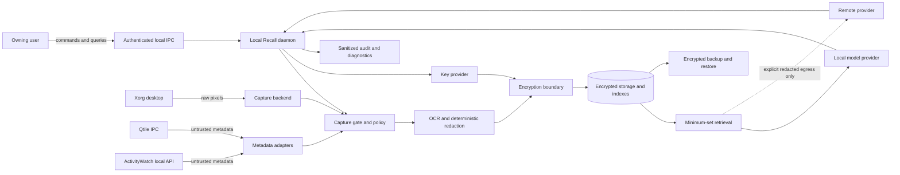

# Local Recall Threat Model

**Status:** Draft for v0.1 architecture and implementation  
**Authority:** This document defines the security and privacy boundaries for Local Recall v0.1. Architecture and implementation may strengthen these controls but may not weaken them without updating the product requirements and this threat model.  
**Tracking issue:** #2  
**Requirements source:** [`docs/requirements.md`](requirements.md)

Lock-source unknown/failure is a fail-closed capture boundary. Unlock signals alone are never sufficient authorization; see [session-safety.md](session-safety.md).

## 1. Security objective

Local Recall intentionally handles unusually sensitive data: screenshots, window context, OCR text, activity history, model prompts, summaries, and derived indexes. The primary security objective is therefore not merely to encrypt a database. It is to prevent unapproved capture, prevent raw data from reaching persistent or remote boundaries, and make failure modes stop recording rather than silently weaken privacy.

The system must preserve these properties:

1. Capture is impossible while the authoritative capture gate is off, paused, locked, or faulted.
2. Work created by an invalid capture generation cannot persist.
3. Raw screenshots, OCR, metadata, prompts, and intermediate values remain transient and are never written to disk.
4. Deterministic redaction completes before encryption, persistence, indexing, summarization, or optional remote egress.
5. Every retained content-bearing artifact is authenticated and encrypted unless this threat model explicitly accepts a narrower plaintext field.
6. A local failure cannot silently select a remote provider.
7. The owning user can inspect, delete, export, and query retained data through authenticated local interfaces.
8. Logs, diagnostics, tests, CI, and failure handling remain useful without exposing captured content or secrets.

These objectives correspond directly to `INV-001` through `INV-015` in the product requirements.

## 2. Method and severity

This model combines asset and data-flow analysis with STRIDE-style threats and privacy abuse cases. Threats include malicious actions, accidental user actions, component defects, unsafe defaults, and race conditions.

Severity is assigned from expected impact and plausible exploitability:

| Severity | Meaning |
|---|---|
| **Critical** | Can produce unapproved capture, plaintext persistence, secret disclosure, unauthorized remote egress, key compromise, or a false claim that recording is off. Must block release. |
| **High** | Can expose substantial activity data, bypass a major policy boundary, defeat deletion, permit unauthorized local access, or corrupt provenance. Must have a planned control and automated verification. |
| **Medium** | Produces limited metadata leakage, availability loss, confusing state, or requires significant preconditions. Must be controlled or explicitly accepted. |
| **Low** | Minor operational or usability effect without meaningful confidentiality or integrity loss. |

A control is not considered complete until its corresponding test fails before implementation, passes after implementation, and propagates any future failure as a non-zero test result as required by `TDD-001` through `TDD-015`.

## 3. Scope

### 3.1 In scope

- The Local Recall daemon and capture lifecycle.
- Xorg screenshot capture.
- Generic Xorg, Qtile, and ActivityWatch metadata adapters.
- Local OCR and deterministic redaction.
- Encryption, key-provider adapters, encrypted storage, indexes, summaries, migrations, retention, deletion, backup, and restore.
- Local generation and embedding providers.
- Optional remote provider routing and egress.
- CLI, status indicator, and local IPC.
- Logs, diagnostics, crash behavior, test fixtures, CI, and release artifacts.

### 3.2 Deferred but constrained

Wayland capture, script-based metadata adapters, local vision models, and a richer local UI are deferred to P2. They remain subject to all existing invariants and require a threat-model update before implementation.

### 3.3 Out of scope as a security guarantee

Local Recall does **not** claim to resist:

- A compromised kernel, hypervisor, firmware, boot chain, or root account.
- A malicious process already executing as the owning user with equivalent access to that user's files, desktop session, debugger facilities, and IPC credentials.
- Physical observation of the screen while content is visible.
- Other X11 clients independently capturing or observing the Xorg session; Xorg itself does not provide strong client isolation.
- Hardware memory acquisition or cold-boot attacks.
- A remote provider retaining explicitly authorized payloads according to its own service terms.

The implementation must still use least privilege, owner-only permissions, process isolation, authenticated encryption, and restricted IPC to reduce exposure. These measures are defense in depth, not a claim that a fully compromised same-user or privileged environment is safe.

## 4. Protected assets

| Asset | Sensitivity | Required protection |
|---|---|---|
| Raw screenshot pixels | Critical | Memory only; generation-bound; never logged, cached, exported, or persisted. |
| Raw OCR output | Critical | Memory only; local processing by default; destroyed after redaction. |
| Raw metadata and titles | Critical | Minimized before collection; memory only until redacted; field-level policy. |
| Redacted screenshot and text | High | Encrypt before persistence; never exposed through unauthenticated previews or remote routing. |
| Activity timestamps and application/workspace context | High | Encrypt where practical; any plaintext index field requires explicit acceptance below. |
| Embeddings and semantic indexes | High | Treat as content-bearing because embeddings can leak source meaning; encrypt or use an explicitly accepted protected design. |
| Summaries, prompts, and model outputs | High | Redacted inputs only; encrypted at rest; provenance retained. |
| Encryption keys and provider credentials | Critical | Key-provider boundary only; never application config, logs, exports, prompts, or capture records. |
| Capture state and generation tokens | Critical integrity | Atomic, monotonic or otherwise non-reusable; stale work cannot write. |
| Policy and configuration | High integrity | Owner-only, validated, versioned, atomic reload, secrets referenced indirectly. |
| Audit and diagnostic logs | Medium to High | Sanitized structured events; owner-only; bounded retention. |
| Backups and migration artifacts | Critical | Encrypted, authenticated, path-safe, no active key material by default. |
| Provenance and citations | High integrity | Authenticated linkage to exact retained records and timestamps. |
| Test and CI artifacts | High | Synthetic only; no real screen capture, personal paths, usernames, or secrets. |

## 5. Actors and attacker profiles

### A1 — Authorized user

The single owning user explicitly controls capture, policies, providers, deletion, and export. User mistakes remain in scope: forgetting capture is on, misconfiguring a broad allowlist, losing keys, or exporting to an unsafe destination.

### A2 — Unprivileged local user

A different local OS account may attempt to read storage, connect to IPC, inspect logs, replace sockets, or exploit world-readable files. Local Recall must defend against this actor.

### A3 — Malicious same-user process

A process running under the same UID may attempt to connect to owner-only IPC, read files available to the user, inject metadata, scrape process memory where OS policy permits, or impersonate local services. Complete defense is not promised. Controls must reduce attack surface through peer credential checks, capability separation, strict socket placement, process sandboxing, and minimal decrypted lifetimes.

### A4 — Offline storage thief

An attacker obtains the disk, backup archive, or copied data directory without active key access. Authenticated encryption must prevent content recovery and undetected modification.

### A5 — Malicious or compromised metadata/provider service

ActivityWatch, Qtile IPC, a local model server, a remote model provider, or a plugin may return malformed, adversarial, oversized, or content-injecting responses. Inputs are untrusted even when reached through localhost.

### A6 — Network attacker

A network attacker may observe or alter remote-provider traffic, exploit an accidentally exposed local service, or trigger unexpected downloads. Local-only operation must require no network. Remote traffic requires explicit routing authorization and normal transport security.

### A7 — Supply-chain attacker

A compromised dependency, package, model, build input, or release artifact may alter capture, redaction, encryption, or egress behavior. Reproducible builds, pinning, review, minimal dependencies, and security tests reduce this risk.

### A8 — Accidental component failure

Crashes, timeouts, race conditions, disk-full states, keyring lock, malformed configuration, corrupted indexes, and model outages are treated as threat events because unsafe recovery can leak data.

## 6. Trust boundaries and process boundaries

The principal trust boundaries are:

| Boundary | Untrusted side | Trusted decision side | Required controls |
|---|---|---|---|
| TB-01 Desktop capture | Xorg pixels and session events | Capture gate | State/generation validation immediately before and after capture; memory-only buffers. |
| TB-02 Metadata adapters | Xorg properties, Qtile, ActivityWatch | Metadata normalization and policy | Fixed APIs/arguments, schema validation, size/time limits, provenance, field minimization. |
| TB-03 Capture pipeline | Raw frame and OCR stages | Redacted typed record | Stage-specific types; no storage interface accepts raw types; cancellation and bounded queues. |
| TB-04 Encryption | Redacted plaintext in memory | Encrypted envelope | Authenticated encryption, nonce safety, associated data, key-provider health, no fallback without configuration. |
| TB-05 Storage | Filesystem/database | Daemon | Owner-only permissions, atomic writes, integrity checks, encrypted content, safe paths. |
| TB-06 Local IPC | Local clients | Daemon authorization | Owner-only Unix socket, safe directory, peer identity, request limits, capability separation. |
| TB-07 Local model | Local model service | Provider adapter | Local endpoint restrictions, redacted payload only, schema validation, timeout, output treated as untrusted. |
| TB-08 Remote egress | External network/provider | Routing and egress gate | Explicit enablement by data class, re-scan, payload preview/limits, TLS, no silent fallback. |
| TB-09 Key provider | OS keyring/GPG/local key store | Encryption adapter | No key material returned beyond minimal use where possible; locked/unavailable means no persistence. |
| TB-10 Backup/restore | Archive and destination | Backup/restore validator | Authenticated archive, no plaintext staging, path containment, schema and recipient validation. |
| TB-11 Observability | Errors and component events | Sanitizer | Opaque IDs and reason codes only; no captured values or provider payloads. |

## 7. Required data flow

The only approved capture flow is:

1. Read the authoritative lifecycle state and current generation.
2. Collect the minimum metadata allowed for pre-capture policy.
3. Validate and normalize metadata from untrusted adapters.
4. Evaluate pre-capture policy.
5. Capture pixels directly into a bounded memory buffer.
6. Recheck lifecycle state and generation after capture.
7. Perform local OCR and deterministic sensitive-data detection in memory.
8. Redact pixels, text, and metadata.
9. Reject the complete item on uncertainty, cancellation, stale generation, or redaction failure.
10. Encrypt the approved redacted record with authenticated associated data.
11. Persist only the encrypted envelope through an atomic write.
12. Produce encrypted or explicitly approved derived indexes and summaries.
13. On an explicit query, select and decrypt only the minimum working set.
14. Send only authorized redacted data to the selected model provider.
15. Destroy decrypted query working data after completion or cancellation.
16. Apply retention and deletion to source records and every derived structure.

No debug mode, plugin, migration, repair command, export, model adapter, or test helper may introduce an alternate path around these steps.

## 8. Persistent artifact inventory

Every persistent artifact must be covered explicitly:

| Artifact | Permitted plaintext | Protection and failure behavior |
|---|---|---|
| Application configuration | Non-secret settings, provider names, key references, policy rules | Owner-only; validated; atomic updates; secrets prohibited. Invalid security settings prevent recording. |
| Capture state file, if any | Minimal non-content state | Must never cause implicit resume. Generation/state integrity checked. Prefer reconstructing safe `off` state. |
| Encrypted record blobs | Envelope version, opaque record ID, ciphertext size | Authenticated encryption. No titles, OCR, summaries, thumbnails, or prompts in filenames. |
| Primary index | Opaque IDs and only threat-model-approved routing fields | Prefer encryption. Plaintext timestamps or coarse buckets require architecture review because they reveal activity patterns. |
| Vector index | No raw text | Treat vectors as sensitive content; encrypted/protected design required. Rebuildable from encrypted source records. |
| Summaries and clusters | No content plaintext | Encrypted and linked to exact source membership. |
| Audit logs | Event type, opaque ID, sanitized reason, timing | No captured content, titles, paths, usernames, prompts, tokens, or key material. Owner-only and retention bounded. |
| Migration journal | Schema versions, opaque IDs, transaction state | No decrypted values. Restartable and integrity checked. |
| Deletion tombstones | Opaque IDs and transaction state | No content. Removed after safe completion according to retention policy. |
| Backup archive | Sanitized manifest and encrypted payloads | Authenticated; no active keys by default; optional explicit GPG recipient encryption. |
| Diagnostic bundle | Versions, capabilities, opaque IDs, sanitized errors | Must pass seeded-content and secret scanning before creation. |
| Model files | Model weights and metadata only | Must not contain captured prompts or caches. No implicit download while recording. |
| Test artifacts | Synthetic fixtures and reports | Must never include the developer's real screen or personal retained data. |

### Accepted metadata leakage

The v0.1 architecture should minimize plaintext index metadata. The following fields may be considered for plaintext only when required for efficient record location and approved in the architecture decision record:

- Opaque record identifier.
- Envelope/schema version.
- Ciphertext length.
- Coarse time bucket rather than exact timestamp.
- Key identifier that reveals no key material.

Exact timestamps, application names, workspace names, window titles, URLs, OCR text, summaries, embeddings, model prompts, and deletion scope are content-bearing and must not remain plaintext by default.

Even approved plaintext metadata leaks existence, approximate volume, access patterns, and possibly activity timing. This is an accepted residual risk only after minimization and documentation.

## 9. Fail-closed matrix

| Failure or uncertainty | Required behavior |
|---|---|
| Capture state cannot be read consistently | Do not capture; transition to or remain non-recording. |
| Session type is unsupported or uncertain | Remain non-recording and expose a sanitized status reason. |
| Lock state is unknown during a lock transition | Deny capture until confirmed unlocked and normal resume policy allows it. |
| Required metadata source is unavailable | Use a fallback only when policy explicitly permits equivalent safe evaluation; otherwise deny capture. |
| Policy fails to parse, compile, reload, or evaluate | Deny affected capture. Invalid global policy faults recording. |
| Regex or policy evaluation exceeds limits | Deny the item and report sanitized policy failure. |
| Screenshot capture fails or returns invalid dimensions | Reject the item; never create a temporary file fallback. |
| OCR fails or times out | Reject the item unless policy explicitly permits a metadata-only record that never contained pixels. |
| Secret detection or redaction is uncertain or fails | Reject the complete record. Repeated systemic failure faults capture. |
| Key provider is missing, locked, revoked, or unhealthy | No persistence. Transition capture to non-recording faulted state. |
| GPG fallback is not explicitly configured and healthy | Do not use it. No persistence. |
| Encryption or authentication fails | No write; clear working buffers; fault or reject according to scope. |
| Storage permissions are insecure | Refuse recording until corrected. |
| Disk is full or an atomic write cannot complete | No partial readable record; pause/fault capture and quarantine incomplete opaque artifacts. |
| Index update fails | Source record commit must be recoverable; do not expose plaintext or silently lose referential integrity. |
| Local model is unavailable | Do not select a remote provider automatically. Capture/indexing may continue only when policy allows. |
| Remote egress authorization or payload inspection fails | Make no remote request. |
| Provider response fails schema or provenance checks | Discard response; do not persist it as trusted fact. |
| IPC peer or socket ownership cannot be verified | Reject the connection or refuse daemon startup. |
| Backup or restore validation fails | Do not extract, overwrite, or import partial content. |
| Deletion transaction fails | Resume or roll back safely; never report deletion complete until all derived references are handled. |
| Required test path discovers or executes zero tests | Fail non-zero. |

## 10. Threat registry

### 10.1 Lifecycle and capture-state threats

#### THR-LIFE-001 — Capture while off

- **Severity:** Critical
- **Scenario:** A timer, metadata event, race, stale callback, or component bypass triggers screenshot, OCR, model, or persistence work while status reports `off`.
- **Controls:** Central capture gate; default-off startup; state checked at every boundary; no backend callable without a current generation capability; `STATE-001`, `FR-CAP-001` through `FR-CAP-004`, `INV-001`.
- **Verification:** Unit tests for every state transition; contract tests asserting each backend is never invoked while off; E2E event storm while off; seeded stale callbacks. Planned in issues #7, #8, #38, and #39.

#### THR-LIFE-002 — Stale work persists after stop

- **Severity:** Critical
- **Scenario:** A frame captured before stop completes redaction or encryption after stop and writes into storage.
- **Controls:** Non-reusable generation/session token on every item; cancellation propagation; generation checked before encryption, before storage, and during derived-index commit; queue destruction on stop/lock/fault; `FR-CAP-004`, `INV-005`.
- **Verification:** Deterministic race tests at every pipeline stage; stop during OCR, encryption, provider request, and storage commit; no resulting record. Issues #7, #8, #11, #38, #39.

#### THR-LIFE-003 — Restart or unlock resumes recording unexpectedly

- **Severity:** High
- **Scenario:** A previous recording state is restored after daemon restart or desktop unlock without explicit policy authorization.
- **Controls:** Startup state is `off`; persisted state cannot imply consent; unlock passes through normal resume policy; daemon-confirmed indicator; `STATE-001`, `STATE-004`, `FR-CAP-001`.
- **Verification:** Restart and lock/unlock E2E tests, including crash during `stopping`. Issues #7, #18, #28, #39.

#### THR-LIFE-004 — Overload creates an unbounded sensitive backlog

- **Severity:** High
- **Scenario:** Slow OCR or local inference causes raw frames to accumulate, remain in memory too long, or persist after their policy context changes.
- **Controls:** Bounded queues, deadlines, coalescing, drop policy, generation invalidation, overload state, `FR-CAP-007`, `FR-CAP-008`, `INV-011`.
- **Verification:** Load and soak tests with blocked workers, bounded-memory assertions, backlog invalidation. Issues #8, #20, #39.

### 10.2 Policy and metadata threats

#### THR-POL-001 — Policy cannot evaluate before pixels are captured

- **Severity:** Critical
- **Scenario:** Missing or conflicting metadata causes a password manager, authentication dialog, or sensitive pentesting workspace to be captured.
- **Controls:** Default-deny sensitive classes; provenance and confidence; required source policy; uncertainty denies capture; post-capture uncertainty rejects before persistence; `FR-POL-001` through `FR-POL-006`.
- **Verification:** Missing, stale, conflicting, and malformed metadata fixtures; sensitive-window focus races; no screenshot call when policy requires unavailable metadata. Issues #13 through #19 and #38.

#### THR-POL-002 — Malicious or pathological policy input

- **Severity:** High
- **Scenario:** Catastrophic regex backtracking, invalid precedence, unsafe reload, or path manipulation causes denial of service or fail-open behavior.
- **Controls:** Validated versioned schema; bounded regex engine or timeouts; deterministic precedence; compile before atomic swap; invalid policy remains non-recording; `FR-POL-005`, `FR-POL-008`.
- **Verification:** Parser and property tests, regex DoS corpus, concurrent reload tests, failure-injection meta-tests. Issues #6, #17, #38.

#### THR-POL-003 — Overbroad allowlist suppresses secret detection

- **Severity:** High
- **Scenario:** A user or malicious config entry broadly allowlists high-entropy strings or an application, turning redaction into a no-op.
- **Controls:** Narrow typed allowlist entries; explicit pattern and scope; audit event; warnings for broad rules; allowlists cannot bypass structural secret classes without explicit high-risk acknowledgment; `FR-RED-008`.
- **Verification:** Tests reject wildcard/global allowlists, scope leakage, and precedence bypass. Issues #6, #9, #17, #38.

#### THR-META-001 — Command injection through metadata adapters

- **Severity:** Critical
- **Scenario:** Window titles or other captured values are interpolated into shell commands, or a configured adapter executes arbitrary code.
- **Controls:** Native APIs where practical; fixed executables and argument arrays; no shell; strict schema; output/time/size limits; script adapters deferred and later allowlisted by absolute path/hash; `FR-META-003` through `FR-META-010`.
- **Verification:** Metacharacter, newline, null-byte, path replacement, symlink, hostile environment, and oversized-output tests. Issues #14 through #16, #34, #38.

#### THR-META-002 — Hostile local-service response

- **Severity:** High
- **Scenario:** Qtile IPC or ActivityWatch returns malformed JSON, huge payloads, spoofed timestamps, injected text, or duplicate events.
- **Controls:** Treat localhost as untrusted; strict typed parsing; bounds; freshness windows; provenance; no direct persistence; redaction and policy always reapplied.
- **Verification:** Fuzzed adapter responses, stale/duplicate events, oversized values, invalid Unicode and timestamps. Issues #13 through #16 and #38.

#### THR-META-003 — Conflicting metadata changes policy outcome

- **Severity:** High
- **Scenario:** Generic Xorg reports one application while Qtile or ActivityWatch reports another, allowing a denied context to be misclassified.
- **Controls:** Source priority is policy-controlled; conflicts retain provenance; safety-sensitive conflict resolves to denial; no silent field overwrite; `FR-META-004`, `FR-META-005`.
- **Verification:** Pairwise conflict matrix and race fixtures. Issues #13 and #17.

### 10.3 Raw-data and redaction threats

#### THR-RAW-001 — Plaintext reaches disk through temporary paths

- **Severity:** Critical
- **Scenario:** Screenshot tools, OCR libraries, serializers, model clients, debug dumps, or exception handlers create temporary images, text files, request traces, thumbnails, or caches.
- **Controls:** Memory-native APIs; filesystem tests; storage accepts encrypted types only; secure temp directory is not considered sufficient; debug logging cannot serialize content; `FR-CAP-009`, `FR-RED-002`, `FR-STO-003`, `INV-002`.
- **Verification:** Filesystem monitoring during every pipeline and failure path; seeded strings scanned across data directory, temp directories, logs, diagnostics, exports, and CI artifacts. Issues #8 through #12 and #38.

#### THR-RAW-002 — Plaintext leaks through swap, core dumps, or process memory

- **Severity:** High
- **Scenario:** Raw buffers survive in swap, crash dumps, allocator reuse, or debugging interfaces.
- **Controls:** Short bounded lifetimes; buffer ownership and explicit release where meaningful; disable or restrict core dumps; avoid copying; process sandboxing; optionally use locked memory for small key material where reliable; never claim guaranteed secure erase in managed runtimes.
- **Verification:** Operational configuration tests for core-dump policy; memory-lifetime tests where feasible; documentation of residual risk. Issues #8, #10, #12, #40.

#### THR-RAW-003 — Decrypted previews are cached

- **Severity:** High
- **Scenario:** Timeline previews, browser caches, image libraries, desktop notifications, or clipboard operations retain decrypted screenshots or text.
- **Controls:** Decrypt on demand; memory-only preview; no-store headers for future UI; no clipboard integration; no thumbnails in notifications; session expiry; `FR-CTL-008`, `FR-CTL-009`.
- **Verification:** Cache/history inspection and notification tests. Issues #28, #30, #36, #38.

#### THR-RED-001 — Deterministic redaction misses a secret

- **Severity:** Critical
- **Scenario:** Unknown token formats, OCR errors, split strings, encoded credentials, or low-confidence detections leave a secret visible in pixels or text.
- **Controls:** Provider-specific patterns plus entropy heuristics; OCR coordinates; conservative low-confidence policy; user patterns; full-record rejection on failure; no model-only control; `FR-RED-003` through `FR-RED-009`, `INV-003`, `INV-014`.
- **Verification:** Synthetic secret corpus across fonts, scaling, line wraps, encodings, partial occlusion, and OCR errors; seeded values scanned through all outputs. Issues #9 and #38.

#### THR-RED-002 — Model classification becomes the only secret control

- **Severity:** High
- **Scenario:** A model says content is safe despite containing credentials, or prompt injection tells it not to redact.
- **Controls:** Deterministic filters are authoritative; model assistance runs only after them and cannot unredact; model output is untrusted; `FR-RED-006`, `INV-014`.
- **Verification:** Adversarial prompts and model outputs cannot remove deterministic findings. Issues #9, #21, #38.

#### THR-RED-003 — OCR coordinates and pixels refer to different frames

- **Severity:** Critical
- **Scenario:** Focus change, crop mismatch, scaling error, or frame reuse causes the text detector to redact the wrong region while storing the secret.
- **Controls:** Immutable frame identity and dimensions; OCR result bound cryptographically or structurally to exact frame ID; coordinate validation; no cross-frame buffer reuse; generation and monitor geometry provenance.
- **Verification:** Focus churn, scaling, multi-monitor, crop, and stale-OCR race tests. Issues #8, #9, #19, #20, #38.

### 10.4 Encryption, key, and storage threats

#### THR-CRYPTO-001 — Unsafe encryption fallback

- **Severity:** Critical
- **Scenario:** Keyring or primary encryption fails and the application stores plaintext, uses a default key, silently switches to GPG, or keeps recording without persistence guarantees.
- **Controls:** No plaintext fallback; GPG is explicit and health checked; key failure faults capture; `FR-STO-005`, `FR-STO-006`, `INV-004`.
- **Verification:** Missing binary, locked keyring, revoked key, wrong recipient, permission failure, and fallback-disabled tests. Issues #10, #11, #38.

#### THR-CRYPTO-002 — Ciphertext tampering, nonce misuse, or record swapping

- **Severity:** Critical
- **Scenario:** An attacker modifies ciphertext, reuses a nonce, swaps envelopes between records, or alters unauthenticated metadata.
- **Controls:** Modern authenticated encryption; unique nonce strategy; associated data binds schema version, opaque record ID, data class, and key ID; authentication before parsing; corrupt records quarantined.
- **Verification:** Bit flips, truncation, replay, record swap, wrong key, duplicate nonce detection, and malformed envelope fuzzing. Issues #10, #11, #38.

#### THR-CRYPTO-003 — Key or credential disclosure

- **Severity:** Critical
- **Scenario:** Key material appears in config, environment dumps, logs, diagnostics, model prompts, backup archives, command arguments, or exceptions.
- **Controls:** Key-provider references; secret-bearing values never formatted into logs; no CLI secret arguments where process listings expose them; backup excludes active keys; provider credentials pass directly to request layer; `FR-STO-007`, `FR-AI-010`.
- **Verification:** Seeded key scanning in all outputs; process-argument tests; diagnostic/export inspection. Issues #10, #12, #23, #32, #38.

#### THR-CRYPTO-004 — Rotation or migration creates plaintext intermediates

- **Severity:** High
- **Scenario:** Re-encryption writes decrypted records to temporary files or leaves mixed-key partial state after interruption.
- **Controls:** Streaming decrypt-to-encrypt in memory; transactional migration journal with opaque IDs; old envelope retained until new authenticated envelope commits; restartable state; `NFR-009`.
- **Verification:** Kill/restart at each migration stage, filesystem scan, wrong-key rollback. Issues #10, #11, #37, #38.

#### THR-STO-001 — Offline database theft

- **Severity:** High
- **Scenario:** An attacker copies the data directory or backup without keys.
- **Controls:** Authenticated encryption for all content-bearing artifacts; owner-only permissions; no descriptive filenames; key material separate; optional full-disk encryption as defense in depth.
- **Verification:** Repository/data-directory inspection and offline decryption tests using no key. Issues #10, #11, #32, #38.

#### THR-STO-002 — Index leaks activity history

- **Severity:** High
- **Scenario:** Plaintext timestamps, application names, vector values, record frequency, or cluster metadata reveal habits even though screenshots are encrypted.
- **Controls:** Encrypt content-bearing indexes; minimize plaintext routing fields; coarse time buckets only by explicit ADR; treat embeddings as sensitive; rebuild indexes from encrypted sources.
- **Verification:** Filesystem string scans, inference review, index dump inspection, model/dimension migration tests. Issues #11, #22, #38.

#### THR-STO-003 — Partial writes or corruption break confidentiality/integrity

- **Severity:** High
- **Scenario:** Power loss, disk full, or concurrent updates leave a readable partial file, orphaned blob, mismatched index, or unauthenticated record.
- **Controls:** Atomic rename/transaction; encrypted envelope complete before commit; integrity checks; quarantine; restartable repair; no content in journal.
- **Verification:** Fault injection at write boundaries, low-disk tests, corruption fuzzing. Issues #11, #31, #37, #38, #39.

#### THR-STO-004 — Deletion leaves derived copies

- **Severity:** High
- **Scenario:** A deleted record remains in vector indexes, summaries, citations, backups, caches, migration artifacts, or orphaned blobs.
- **Controls:** Explicit deletion graph; atomic/recoverable transaction; tombstones; index and summary rebuild; cryptographic deletion where practical; honest completion state; `FR-CTL-010`, `FR-CTL-011`, `FR-LIFE-003`, `FR-LIFE-004`.
- **Verification:** Delete then search/query/filesystem inspect; interrupted deletion resume; source/derived reference accounting. Issues #30, #31, #38, #39.

### 10.5 Local IPC and control threats

#### THR-IPC-001 — Another local user controls or queries the daemon

- **Severity:** Critical
- **Scenario:** A different OS account connects to a world-readable socket, reads timeline data, enables recording, or exports records.
- **Controls:** Owner-only Unix socket in an owner-only directory; peer credential validation; no TCP listener by default; operation authorization; strict umask; startup ownership checks; `FR-CTL-002` through `FR-CTL-004`, `INV-010`.
- **Verification:** Multi-user permission tests, socket ownership tampering, unauthorized query/control/export attempts. Issues #12, #29, #38.

#### THR-IPC-002 — Malicious same-user process abuses authorized IPC

- **Severity:** High residual risk
- **Scenario:** Malware under the same UID invokes queries, deletion, export, or recording controls using the user's authority.
- **Controls:** Capability-separated endpoints/tokens where practical; explicit confirmation for export/destructive scope; rate limits; audit; short-lived UI sessions; service sandboxing. Owner-only IPC alone does not solve this threat.
- **Verification:** Capability and authorization tests; destructive operation confirmation tests. Issues #29, #30, #32, #36, #40.
- **Residual risk:** A fully compromised user session can usually impersonate the user. This is accepted for v0.1 and must be documented.

#### THR-IPC-003 — Socket replacement, symlink, or stale endpoint

- **Severity:** High
- **Scenario:** An attacker pre-creates or replaces the socket path, redirects clients, or causes the daemon to connect to a stale malicious endpoint.
- **Controls:** Safe runtime directory; reject symlinks and wrong ownership/mode; atomic socket creation; verify peer credentials on both sides where supported; clean stale socket only after validation.
- **Verification:** Symlink, path replacement, wrong-owner, stale-socket, and race tests. Issues #29 and #38.

#### THR-IPC-004 — Query work starves emergency stop

- **Severity:** High
- **Scenario:** Expensive model queries or malicious clients consume all workers, delaying stop or privacy mode.
- **Controls:** Separate prioritized control mailbox/actor; bounded query concurrency; cancellation; stop does not depend on model worker availability; `FR-CAP-003`, `NFR-004`.
- **Verification:** Saturate query/model workers and assert stop meets defined bound. Issues #7, #8, #27, #29, #39.

### 10.6 Model provider and remote-egress threats

#### THR-AI-001 — Silent remote fallback

- **Severity:** Critical
- **Scenario:** Ollama is unavailable and the router automatically sends data to OpenRouter or another remote provider.
- **Controls:** Explicit routing policy; remote disabled by default; local failure never widens route; egress permission by data class; `FR-AI-005` through `FR-AI-008`, `INV-006`, `INV-007`.
- **Verification:** Mock local failures across every route and assert zero network requests in `privacy-strict`, `local-only`, and unconfirmed `local-first`. Issues #21, #23, #38, #39.

#### THR-AI-002 — Raw or secret-bearing remote egress

- **Severity:** Critical
- **Scenario:** A prompt, screenshot, metadata field, authorization header, debug trace, or provider retry includes unredacted data or credentials.
- **Controls:** Remote interfaces accept redacted typed payloads only; second deterministic egress scan; images denied by default; payload size/data-class allowlist; credentials separated from prompt; sanitized audit; `FR-AI-008` through `FR-AI-013`.
- **Verification:** Mock servers capture exact headers and bodies; seeded secret corpus; retries and exceptions; image-type rejection. Issues #9, #23, #33, #38.

#### THR-AI-003 — Prompt injection or malicious provider output corrupts records

- **Severity:** High
- **Scenario:** Captured text instructs a model to reveal secrets, alter citations, delete data, or claim unsupported activity; a provider returns malformed or adversarial structured output.
- **Controls:** Models have no direct tool authority over capture, storage, keys, deletion, or routing; outputs schema validated; provenance generated outside model; deterministic secret controls precede model; answers distinguish inference; `FR-RET-006` through `FR-RET-009`.
- **Verification:** Prompt-injection corpus, forged citations, invalid schema, tool-call-like text, unsupported factual claims. Issues #21, #25, #26, #38.

#### THR-AI-004 — Unexpected network use or model download

- **Severity:** High
- **Scenario:** A provider library downloads weights, telemetry, tokenizer files, or updates while recording or in local-only mode.
- **Controls:** Models installed explicitly; no implicit download; network-disabled tests; dependency telemetry disabled; `FR-AI-014`, `NFR-001`, `NFR-011`.
- **Verification:** Local-only E2E with network namespace disabled; filesystem/model availability failure without download. Issues #21, #22, #39, #40.

#### THR-AI-005 — Local model endpoint is exposed or impersonated

- **Severity:** Medium to High
- **Scenario:** Ollama or another local endpoint listens beyond loopback, a local attacker impersonates it, or other users can inspect requests.
- **Controls:** Document and health-check endpoint binding; prefer Unix socket or loopback; no raw payloads regardless; request limits; provider identity/config validation; service sandboxing.
- **Verification:** Refuse non-local endpoint in privacy-strict mode unless explicitly configured; bind and ownership tests. Issues #21, #23, #37, #40.

### 10.7 Retrieval, provenance, backup, and operations threats

#### THR-RET-001 — Query decrypts too much data

- **Severity:** High
- **Scenario:** A broad or malformed query decrypts the entire history, holds it in memory, or sends excessive context to a model.
- **Controls:** Time and scope planning; hard maximum working set; staged retrieval; minimum-set decryption; bounded prompts; cancellation clears buffers; `FR-RET-001` through `FR-RET-004`.
- **Verification:** Broad-query limits, cancellation, memory bounds, provider payload size tests. Issues #22, #24, #26, #38, #39.

#### THR-RET-002 — False or untraceable answers

- **Severity:** High integrity/privacy impact
- **Scenario:** The model invents activity, merges unrelated tasks, or cites records not used in the answer.
- **Controls:** Exact cluster membership; citations assembled from retrieval results; observation/inference distinction; insufficient-evidence response; authenticated provenance; `INV-012`.
- **Verification:** Synthetic timelines with distractors, empty retrieval, rapid task switching, citation mutation. Issues #24 through #26 and #39.

#### THR-BACKUP-001 — Export contains plaintext or active keys

- **Severity:** Critical
- **Scenario:** Backup tooling decrypts records into an archive, includes key material, or leaves temporary plaintext.
- **Controls:** Copy authenticated encrypted envelopes; sanitized manifest; active keys excluded; explicit recipient encryption; no plaintext staging; `FR-LIFE-005`, `FR-LIFE-006`.
- **Verification:** Archive inspection, temp-directory monitoring, recipient mismatch, key scanning. Issues #32 and #38.

#### THR-BACKUP-002 — Malicious restore archive escapes destination or corrupts state

- **Severity:** High
- **Scenario:** Path traversal, symlinks, duplicate IDs, incompatible schemas, zip bombs, or crafted manifests overwrite files or exhaust resources.
- **Controls:** Never trust archive paths; bounded extraction; path containment; reject links/special files; schema/integrity/key validation before commit; restore into isolated staging containing ciphertext only.
- **Verification:** Traversal, absolute path, symlink, duplicate, oversized, truncated, corrupted, and wrong-key fixtures. Issues #32 and #38.

#### THR-OPS-001 — Logs, diagnostics, and crashes leak content

- **Severity:** Critical
- **Scenario:** Exceptions stringify frames, OCR, prompts, titles, paths, usernames, headers, or key values; crash reporters upload diagnostics.
- **Controls:** Structured sanitized events; opaque IDs; no third-party crash reporting or telemetry; owner-only logs; core-dump restrictions; errors created without content-bearing objects; `INV-008`, `NFR-011`.
- **Verification:** Seeded secret/text scans across normal and failure logs, diagnostic bundles, traceback paths, CI artifacts. Issues #12, #37, #38.

#### THR-OPS-002 — Supply-chain component bypasses security stages

- **Severity:** High
- **Scenario:** A dependency, package, model, or plugin performs network calls, writes caches, logs prompts, or bypasses typed stage boundaries.
- **Controls:** Minimize and pin dependencies; reproducible Nix build; license/dependency review; sandbox service; provider adapters own all external calls; no arbitrary plugin loading in v0.1; source review for security-critical libraries.
- **Verification:** Network-disabled tests, filesystem monitoring, dependency audit, reproducible build checks. Issues #4, #23, #38, #40, #41.

#### THR-TEST-001 — Tests capture the developer's real screen or data

- **Severity:** Critical
- **Scenario:** Unit/E2E tests call the live Xorg backend, scan the user's data directory, or upload real artifacts to CI.
- **Controls:** Synthetic capture sources and isolated virtual displays; explicit test profile; real backend disabled in tests unless inside controlled synthetic desktop; CI has no access to user data; `TDD-013`.
- **Verification:** Guard tests detect real display/home paths and fail; E2E uses isolated fixtures only. Issues #4, #38, #39.

#### THR-TEST-002 — False-green tests conceal a privacy failure

- **Severity:** Critical
- **Scenario:** Assertions, crashes, zero-test selection, timeouts, or sanitizer failures still exit zero because of wrappers, pipelines, retries, skips, or CI configuration.
- **Controls:** Canonical commands preserve exit status; zero tests fail; no `|| true`, `continue-on-error`, `allow_failure`, or pass-with-no-tests; deliberate failure-injection meta-tests; `TDD-007` through `TDD-015`.
- **Verification:** Seed each failure class and assert local and CI top-level non-zero result. Issues #4, #38, #39, #41.

## 11. Privacy invariant verification plan

| Invariant | Required evidence | Planned issues |
|---|---|---|
| `INV-001` Hard off | State-machine unit tests, backend contract tests, off-state event-storm E2E | #7, #8, #38, #39 |
| `INV-002` No plaintext persistence | Type barriers, filesystem monitoring, seeded-string scans across temp/log/export/CI | #8–#12, #32, #38 |
| `INV-003` Redact before retain | Pipeline-order tests, storage rejects unredacted types, synthetic secret corpus | #5, #9–#11, #38 |
| `INV-004` Fail closed | Failure matrix tests for policy, redaction, key, permissions, backend, egress | #6, #7, #9–#12, #17, #23, #38 |
| `INV-005` Stale work cannot persist | Generation race tests at every asynchronous stage | #7, #8, #11, #38, #39 |
| `INV-006` Local by default | Offline E2E and zero-network assertions | #21, #22, #26, #39 |
| `INV-007` No implicit egress downgrade | Local-provider failure matrix with mock remote endpoints | #23, #38, #39 |
| `INV-008` Sanitized observability | Seeded secret/content scans over logs, errors, diagnostics, CI | #12, #37, #38 |
| `INV-009` Visible recording | Daemon/UI state synchronization and restart tests | #28, #39 |
| `INV-010` Least-privilege IPC | Multi-user, ownership, peer credential, socket-race tests | #29, #38 |
| `INV-011` Bounded work | Queue/property tests, overload load test, soak test | #8, #20, #39 |
| `INV-012` Traceable answers | Synthetic retrieval/citation mutation tests | #24–#26, #39 |
| `INV-013` Explicit destructive scope | Deletion/export authorization and audit tests | #30–#32, #38 |
| `INV-014` No model-only secret control | Adversarial model output cannot remove deterministic findings | #9, #21, #38 |
| `INV-015` No hidden capture expansion | Configuration/schema tests reject undeclared data classes; requirements review gate | #1, #6, #38, #41 |

## 12. Security and privacy test rules

- Security behavior begins with a failing abuse-case, invariant, or regression test.
- Tests use synthetic secrets and synthetic desktop content only.
- Every Critical and High threat must have at least one automated unit, integration, security, or E2E test before its implementing issue closes.
- Tests must cover normal behavior and the fail-closed branch.
- Race-sensitive controls require deterministic clocks, fake providers, barriers, and controlled cancellation rather than sleep-based tests.
- Filesystem and network side effects must be observable in tests so hidden temporary writes or egress fail the suite.
- Security test wrappers must propagate assertions, crashes, signals, timeouts, sanitizer findings, setup/teardown failures, and empty selections as non-zero.
- Required security tests cannot be skipped or marked expected-failure at release time.

## 13. Accepted residual risks

The following risks remain after planned controls:

1. **Compromised privileged environment:** Root, kernel, hypervisor, firmware, or boot compromise defeats application-level protections.
2. **Compromised same-user session:** Malware with the user's UID may invoke IPC, observe Xorg, inspect user-accessible files, or steal unlocked credentials. v0.1 reduces but cannot eliminate this risk.
3. **Xorg isolation:** Other X11 clients may independently capture screen contents or manipulate focus and properties. Local Recall validates its own inputs but cannot repair Xorg's security model.
4. **Transient plaintext memory:** Screenshots and OCR must exist briefly in memory. Secure erasure is not guaranteed by managed runtimes, allocators, swap, or hardware.
5. **Redaction false negatives:** Deterministic and OCR-based detection cannot guarantee recognition of every secret or sensitive visual element. Sensitive-context pre-capture denial and manual privacy mode remain necessary.
6. **Authorized remote disclosure:** Once the user explicitly authorizes a remote provider, the provider receives the approved redacted payload and may retain it under its policies.
7. **Traffic and size analysis:** Encrypted records may reveal approximate count, size, timing, and access patterns even when content is protected.
8. **Key loss:** Strong encryption means unrecoverable keys can make records permanently unavailable. Recovery procedures must not introduce escrow silently.
9. **Third-party content:** Screenshots may include information belonging to other people. The user is responsible for lawful and appropriate capture; the product minimizes and exposes controls but cannot infer every consent boundary.
10. **Model inaccuracy:** Cited retrieval reduces hallucination but cannot guarantee perfect summaries. Answers must preserve evidence boundaries.

## 14. Assumptions requiring architecture confirmation

Issue #3 must resolve and document:

- The runtime and concurrency model used to serialize lifecycle commands and cancel workers.
- The exact authenticated-encryption construction, nonce strategy, envelope associated data, and key-provider behavior.
- Whether exact timestamps or coarse buckets are plaintext in the index.
- How embeddings are encrypted or otherwise protected while remaining searchable.
- The IPC peer-authentication and capability model, including the same-user residual risk.
- The process sandbox and network restrictions for the daemon and provider adapters.
- Core-dump, swap, temporary directory, and memory-lifetime hardening.
- Transaction boundaries for record, index, summary, deletion, migration, and backup operations.
- How daemon-confirmed visible status is guaranteed before recording begins.

An architecture choice that cannot satisfy a Critical threat control must change the architecture, not weaken this model silently.

## 15. Review and change control

This threat model must be reviewed when any of the following changes:

- A new capture data class is added.
- A new persistent artifact or plaintext index field is introduced.
- A new local or remote provider is added.
- A new metadata source, script adapter, desktop platform, or UI surface is added.
- Encryption, key management, backup, migration, deletion, or IPC behavior changes.
- Off, pause, lock, fault, or restart semantics change.
- A security or privacy defect reveals a missing threat.

Required update sequence:

1. Add or revise the threat and severity.
2. Link the affected product requirements and invariants.
3. Write the failing security/privacy test.
4. Implement or strengthen the control.
5. Update residual-risk and user-facing documentation.
